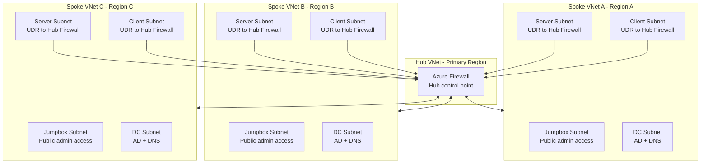
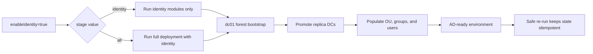
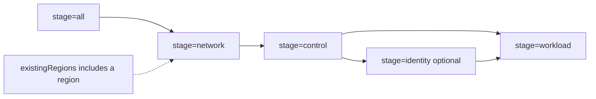
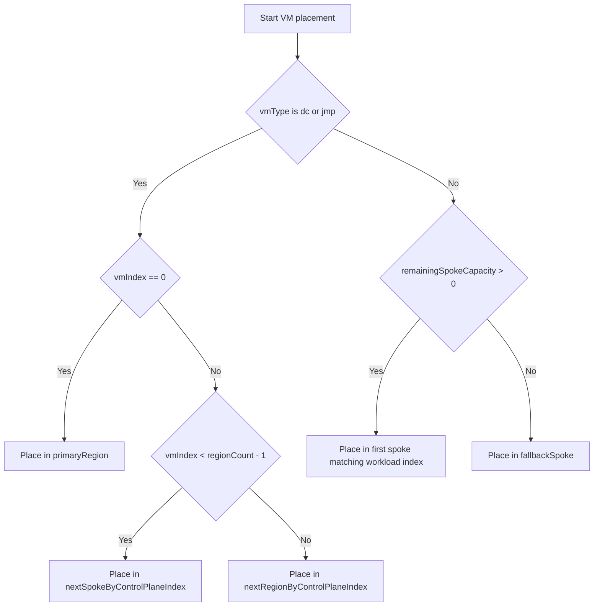
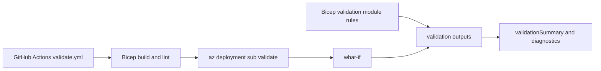

# Azure Multi-Region Lab (AMRL) v2.2

## Overview

This project implements a multi-region Azure lab environment using Bicep. It demonstrates a structured evolution from basic infrastructure deployment into a secure, modular, capacity-aware, and production-aligned platform, now including a staged identity foundation for Active Directory (AD).

The lab is designed to showcase real-world Infrastructure as Code practices, including:

- Deterministic and repeatable deployments  
- Modular architecture using reusable components  
- Secure-by-default design principles  
- Controlled workload distribution across multiple regions  
- Validation-first deployment to detect configuration errors early

Optional identity staging bootstraps AD, promotes replica Domain Controllers (DCs), and performs directory population for OU, group, and user seeding.

For the fastest setup path, go to [Quick Start (Demo Setup)](#quick-start-demo-setup).

---

## Table of Contents

<details>
<summary><strong>Overview</strong></summary>

- [Overview](#overview)
  - [Foundational Concepts](#foundational-concepts)
    - [Core Terminology](#core-terminology)
    - [Design Principles](#design-principles)
  - [Project Evolution](#project-evolution)

</details>

<details>
<summary><strong>Architecture Overview</strong></summary>

- [Architecture Overview](#architecture-overview)
  - [Network Architecture](#network-architecture)
    - [Network Architecture Diagram](#network-architecture-diagram)
    - [Traffic Flow](#traffic-flow)
    - [Subnet Roles and Network Segmentation](#subnet-roles-and-network-segmentation)
    - [IP Addressing Strategy](#ip-addressing-strategy)
    - [DNS Configuration and Strategy](#dns-configuration-and-strategy)
  - [Identity Architecture & Reconciliation Model](#identity-architecture--reconciliation-model)
    - [Identity Deployment Flow](#identity-deployment-flow)
    - [AD Integration](#ad-integration)
    - [Identity Automation Design](#identity-automation-design)
    - [Directory Model Configuration](#directory-model-configuration)
    - [Directory Population](#directory-population)
    - [How Reconciliation Works](#how-reconciliation-works)
      - [Reconciliation Token (Force-Rerun Mechanism)](#reconciliation-token-force-rerun-mechanism)
    - [AD Domain Automation](#ad-domain-automation)
  - [Security Model](#security-model)
    - [VM Security Features](#vm-security-features)
    - [NSG Rules by Subnet Role](#nsg-rules-by-subnet-role)
  - [Placement Rules](#placement-rules)
    - [Placement Recalculation Warning](#placement-recalculation-warning)

</details>

<details>
<summary><strong>File Structure</strong></summary>

- [File Structure](#file-structure)
  - [Root Files](#root-files)
  - [Modules](#modules)
    - [Networking](#networking)
    - [Compute](#compute)
    - [Identity](#identity)
    - [Peering](#peering)
    - [Logic](#logic)
  - [Supporting Logic in main.bicep](#supporting-logic-in-mainbicep)
  - [Foundation Layer (External)](#foundation-layer-external)

</details>

<details>
<summary><strong>Start Guide</strong></summary>

- [Quick Start (Demo Setup)](#quick-start-demo-setup)
  - [Required Placeholder Values](#required-placeholder-values)
  - [Quick Demo Steps](#quick-demo-steps)
    - [Identity Setup Notes](#identity-setup-notes)
- [Start Guide (Detailed)](#start-guide-detailed)
  - [Step 1: Understand the Core Concept](#step-1-understand-the-core-concept)
  - [Step 2: Core Deployment Settings](#step-2-core-deployment-settings)
  - [Step 3: Region Mapping](#step-3-region-mapping)
  - [Step 4a: Subnet Mapping](#step-4a-subnet-mapping)
  - [Step 4b: Greenfield and Brownfield Deployments](#step-4b-greenfield-and-brownfield-deployments)
    - [Relationship Between Stages and Brownfield Deployments](#relationship-between-stages-and-brownfield-deployments)
    - [Stage Dependency Diagram](#stage-dependency-diagram)
    - [Parameters That Can Be Changed Between Deployments](#parameters-that-can-be-changed-between-deployments)
    - [Changes Requiring Careful Planning](#changes-requiring-careful-planning)
    - [Supported Deployment Models](#supported-deployment-models)
    - [Design Principle](#design-principle)
  - [Step 5: VM Counts (Controls Scale)](#step-5-vm-counts-controls-scale)
  - [Step 6: Role-Based VM Sizing and Storage](#step-6-role-based-vm-sizing-and-storage)
  - [Step 7: Jumpbox Allowed Sources](#step-7-jumpbox-allowed-sources)
  - [Step 8: Key Vault Setup (Required)](#step-8-key-vault-setup-required)
  - [Step 8a: Identity Foundation Stage (Optional)](#step-8a-identity-foundation-stage-optional)
  - [Step 9: Deploy](#step-9-deploy)
  - [Step 10: Validate Results](#step-10-validate-results)

</details>

<details>
<summary><strong>Configuration Parameters Reference</strong></summary>

- [Configuration Parameters Reference](#configuration-parameters-reference)
  - [Core Deployment Settings](#core-deployment-settings)
  - [Region and Network Configuration](#region-and-network-configuration)
  - [Virtual Machine Configuration](#virtual-machine-configuration)
  - [Security and Access](#security-and-access)
  - [Credentials and Secrets](#credentials-and-secrets)
  - [Identity Configuration (Optional)](#identity-configuration-optional)
  - [Step 9: Deploy](#step-9-deploy)
    - [Full Deployment](#full-deployment)
    - [Stages](#stages)
    - [Recommended Deployment Order](#recommended-deployment-order)
  - [Step 10: Validate Results](#step-10-validate-results)
    - [Key Outputs](#key-outputs)
    - [How to Use These Outputs](#how-to-use-these-outputs)

</details>

<details>
<summary><strong>Access, Authentication and Administration</strong></summary>

- [Access, Authentication and Administration](#access-authentication-and-administration)
  - [Windows Administration](#windows-administration)
  - [Linux Administration](#linux-administration)
    - [How to Connect to Linux VMs](#how-to-connect-to-linux-vms)
  - [Active Directory User Access](#active-directory-user-access)
  - [Linux Domain Authentication](#linux-domain-authentication)
  - [Linux Administrator Delegation](#linux-administrator-delegation)
  - [Current V2.2 Access Model](#current-v22-access-model)
  - [SSH Key Deployment](#ssh-key-deployment)
  - [Future Enhancement Consideration](#future-enhancement-consideration)

</details>

<details>
<summary><strong>Placement Engine</strong></summary>

- [Placement Engine](#placement-engine)
  - [Rules](#rules)
  - [Placement Decision Flow](#placement-decision-flow)
  - [Why this matters](#why-this-matters)

</details>

<details>
<summary><strong>Validation</strong></summary>

- [Validation](#validation)
  - [Important: Pre-Deployment Azure Resource Validation](#important-pre-deployment-azure-resource-validation)
  - [Validation Pipeline Diagram](#validation-pipeline-diagram)
  - [CI Workflow Validation (`validate.yml`)](#ci-workflow-validation-validateyml)
    - [GitHub Actions Prerequisites](#github-actions-prerequisites)
      - [Quick CLI Setup (PowerShell)](#quick-cli-setup-powershell)
      - [References](#references)
    - [Trial Subscription Note](#trial-subscription-note)
  - [Release Workflow (`release.yml`)](#release-workflow-releaseyml)
  - [Bicep Template Validation Rules](#bicep-template-validation-rules)
    - [Placement and Capacity Rules](#placement-and-capacity-rules)
    - [Configuration Rules](#configuration-rules)
    - [Identity and Department Rules](#identity-and-department-rules)
    - [Stage and Brownfield Deployment Rules](#stage-and-brownfield-deployment-rules)
  - [Bicep Template Validation Outputs](#bicep-template-validation-outputs)

</details>

<details>
<summary><strong>Outputs</strong></summary>

- [Outputs](#outputs)
  - [Core Outputs](#core-outputs)
  - [Purpose](#purpose)
  - [Best Practice](#best-practice)

</details>

<details>
<summary><strong>Known Limitations</strong></summary>

- [Known Limitations](#known-limitations)

</details>

<details>
<summary><strong>Third-Party Components</strong></summary>

- [Third-Party Components](#third-party-components)
  - [Relationship to AMRL](#relationship-to-amrl)
  - [AMRL Enhancements](#amrl-enhancements)
  - [Files Derived From or Inspired By Set-DummyAD](#files-derived-from-or-inspired-by-set-dummyad)
  - [Notes](#notes)

</details>

<details>
<summary><strong>Future Plans</strong></summary>

- [Future Plans](#future-plans)

</details>

---

## Quick Start (Demo Setup)

Use this section if you want the fastest path to a working demo.

### Required Placeholder Values

The demo parameter template contains these three placeholders:

- `<YOUR_PUBLIC_IP>/32`
- `<SSH_PUBLIC_KEY>`
- `<KEYVAULT_ID>`

### Quick Demo Steps

1. Copy `main.parameters.demo.json` to a local parameters file.
2. Replace the three placeholders listed above in your local parameters file.
3. Create an Azure Key Vault (if you do not already have one) and add these secrets:
  - `jumpboxAdminPassword`
  - `serverAdminPassword`
  - `clientAdminPassword`

   See [Step 8: Key Vault Setup (Required)](#step-8-key-vault-setup-required) for required configuration.

4. Deploy locally:

```powershell
az deployment sub create `
  --name demo-deployment `
  --location westeurope `
  --template-file main.bicep `
  --parameters <your-local-parameters-file>.json
```

For full parameter-by-parameter guidance, continue with [Start Guide (Detailed)](#start-guide-detailed).

> **Note on Linux VMs**
>
> If deploying Linux virtual machines (`linuxServer` or `linuxClient`), you must also add the SSH public key to Key Vault.
>
> Before uploading the SSH public key, complete [Step 8: Key Vault Setup (Required)](#step-8-key-vault-setup-required) so your account has secret write permissions.
>
> Create an SSH key first if you do not already have one:
> ```powershell
> New-Item -ItemType Directory -Force "$HOME/.ssh" | Out-Null
> ssh-keygen -t ed25519 -f "$HOME/.ssh/id_ed25519"
> ```
> When prompted for a passphrase, press Enter twice to leave it empty.
>
> Then upload `id_ed25519.pub` to Key Vault:
> ```powershell
> az keyvault secret set --vault-name <key-vault-name> --name sshPublicKey --value ((Get-Content "$HOME/.ssh/id_ed25519.pub" -Raw).Trim())
> ```
>
> Upload the matching private key as `sshPrivateKey`:
> ```powershell
> az keyvault secret set --vault-name <key-vault-name> --name sshPrivateKey --file "$HOME/.ssh/id_ed25519"
> ```
>
> Linux administration uses SSH key authentication from jumpbox hosts. For details, see [Linux Administration](#linux-administration).

> **Note on Subscription Types**
>
> Available regions, VM sizes, VM images, and regional vCPU quotas vary significantly by subscription type:
> - **Trial/Free subscriptions**: Often have restricted regions and may not support all VM sizes or images (particularly large and premium SKUs); may lack Generation 2 (Gen2) image availability in all regions
> - **Student subscriptions**: Typically limited to a small set of regions with reduced quota; may not support premium VM sizes or all regions
> - **Standard/Pay-as-you-go subscriptions**: Generally have broader availability
>
> Before deploying, verify that your subscription supports:
> - The regions specified in `regionIndexMap`
> - The VM sizes specified in `vmSizes`
> - **Generation 2 (Gen2) OS images** in your target regions (all images must have `-g2` in the SKU)
> - Sufficient vCPU quota for your `maxVmsPerRegion` and `regionCount` settings
>
> **Important**: Before deploying, verify that your target regions support the required VM sizes and images. Use the commands below to check availability in your subscription:
> ```powershell
> az vm list-sizes --location <region> -o table
> az vm image list-publishers --location <region> -o table
> ```
> Deployments may fail if required SKUs are unavailable in your regions (common in Trial and Student subscriptions).

#### Identity Setup Notes

- `main.parameters.demo.json` keeps `enableIdentity` disabled by default for fast baseline demos.
- `stage=identity` is not a standalone first-run path; control-plane DC VMs must already exist (or use `stage=all`).
- Identity scope includes forest bootstrap, replica promotion, directory population for OU, group, and user seeding, and automated domain join for Windows and Linux systems.

---

## Foundational Concepts

### Core Terminology

**Greenfield Deployment**: Creating entirely new infrastructure from scratch. All networking, compute, and identity resources are created fresh.

**Brownfield Deployment**: Reusing existing infrastructure (typically networking) and adding new resources on top. Controlled by the `existingRegions` parameter.

**Reconciliation Model**: Identity automation that can be safely re-executed. Scripts check whether the target state already exists before making changes. If something is missing, it is recreated automatically.

**AGDLP**: Active Directory Group Policy Linking pattern. Global Security Groups (containing users) are nested into Domain Local Security Groups (which hold actual file share permissions).

**Stage**: Deployment execution mode that controls which resource types are deployed (`network`, `control`, `identity`, `workload`, or `all`).

**DC (Domain Controller)**: Primary (`dc01`) or replica (`dc02`, `dc03`, etc.) domain controllers. The primary DC creates the forest; replicas sync from it.

**Idempotent**: Deployments can be run multiple times safely. Re-running produces the same end state without errors or unwanted recreation.

### Design Principles

The solution is built on these foundational principles:

- **Deterministic deployment** — The same inputs always produce the same infrastructure layout
- **Separation of concerns** — Networking, compute, security, and placement logic are clearly separated
- **Data-driven design** — Deployment behaviour is controlled through parameter configuration
- **Validation before deployment** — Invalid configurations are detected and blocked early
- **Balanced multi-region distribution** — Workloads are evenly distributed while respecting regional constraints
- **Security-first approach** — Minimal exposure, controlled access paths, and secure credential handling

---

### Project Evolution

The solution was developed iteratively, with each phase introducing additional architectural capability:

- **v1.0 — IaC Baseline**  
  Introduced the initial Bicep-based multi-region deployment baseline with static Azure Virtual Network (VNet) peering and CLI-driven execution.

- **v1.5 — Automation and Validation**  
  Standardised and automated subscription-scope deployments with repeatable validation and cross-region connectivity testing.

- **v1.6 — Core Network Foundation**  
  Multi-region networking, subnet segmentation, and DNS structure.

- **v1.7 — Security and Modularity**  
  Network Security Groups (NSGs), role-based segmentation, and VNet peering.

- **v1.8 — Modular Architecture**  
  Separation of components into reusable modules and integration with Key Vault.

- **v1.9 — Security Hardening and Identity**  
  Introduction of a jumpbox model, private-only workloads, hub firewall routing, and hardened authentication.

- **v1.10 — Placement and Validation Engine**  
  Deterministic Virtual Machine (VM) placement, predictable network addressing, capacity-aware distribution, route-table driven traffic control, and pre-deployment validation.

- **v1.11 — Hub-Spoke Networking**  
  Hub-and-spoke VNet peering combined with centralised firewall-based routing, spoke route tables, and refined network flow control across regions.

- **v1.12 — Stage-Based Deployment Control**  
  Introduced stage-based deployment orchestration (`network`, `control`, `workload`, `all`) and refined subnet/firewall index handling to support safer incremental and brownfield-aligned deployment flows.

- **v1.13.1 — Role-Based VM Sizing and Storage**  
  Role-based compute sizing and OS disk configuration (`vmSizes`, `osDisks`) with per-role disk size support.

- **v1.13.2 — GitHub Actions and CI/CD Foundation**  
  Introduced GitHub Actions CI/CD with Azure OpenID Connect (OIDC) authentication, Bicep build/lint checks, deployment validation, What-If integration, and a demo deployment profile.

- **v2.0 — Identity Foundation**
  Staged Active Directory (AD) deployment with automated forest creation and replica promotion via Azure VM Run Command.

- **v2.1 — Directory Population**
  Directory population with OU creation, AGDLP group seeding, share provisioning, and idempotent user population.

- **v2.1.1 – Brownfield Networking Support**
  Region-aware networking reuse using `existingRegions` for brownfield deployments.

- **v2.2 – Domain Join Automation, Reconciliation & Department Parameter Refactoring**
  Automated domain join for Windows and Linux systems with customisable OU placement. Introduced identity reconciliation through re-executable Azure VM Run Commands, allowing identity deployments to safely self-heal and recreate missing required objects. Refactored department parameters into sysAdminDepartment and additionalDepartments.

[Back to top](#table-of-contents)
---

## Architecture Overview

The deployment creates a consistent infrastructure footprint across multiple Azure regions using a hub-spoke topology with deterministic placement and identity automation.

### Network Architecture

- Spoke server and client subnets use User-Defined Routes (UDRs) to direct traffic through the hub firewall
- Hub firewall provides centralised east-west traffic inspection and acts as the control point for inter-region communication
- Controlled administrative access via regional jumpboxes (only tier with public exposure)
- Subnet-level traffic segmentation enforced using NSGs

This design enforces centralised security by preventing direct spoke-to-spoke communication and routing all inter-network traffic through the hub firewall.

#### Network Architecture Diagram



Traffic path: Spoke VM -> UDR -> Hub Firewall -> Destination Spoke VM (no direct spoke-to-spoke path).

#### Traffic Flow

Spoke workloads do not talk directly to each other by default. Instead:

- Server and client subnets in spoke regions use route tables to send internal traffic to the hub firewall
- The hub firewall applies the central routing and security control point
- Jumpboxes remain the entry point for administration
- NSGs still enforce subnet-level access rules

#### Subnet Roles and Network Segmentation

Each region contains five subnets with distinct security functions:

- **DC Subnet**: Hosts domain controllers; restricted to AD-related traffic (DNS, Kerberos, LDAP, LDAPS, RPC, SMB, Global Catalog, NTP) plus RDP from jumpbox only
- **Jumpbox Subnet**: Hosts regional jumpbox; RDP access only from `jumpboxAllowedSources` IPs
- **Server Subnet**: Hosts Windows and Linux servers; RDP/SSH from jumpbox only; AD protocol access from internal 10.0.0.0/8
- **Client Subnet**: Hosts Windows and Linux clients; RDP/SSH from jumpbox only (SSH conditional on `enableClientSsh`); AD protocol access from internal 10.0.0.0/8
- **Firewall Subnet** (hub only): Hosts Azure Firewall with baseline rule allowing all internal (10.0.0.0/8) traffic

Traffic between subnets is enforced through NSGs and the hub firewall, ensuring segmentation and controlled inter-region communication.

#### IP Addressing Strategy

All VMs use **Dynamic private IP allocation**.

DCs are deployed into dedicated **DC subnets per region**. Azure assigns IP addresses deterministically within each subnet:

- `.0–.3` are reserved by Azure  
- `.4` is the first usable IP address  

Because DCs are deployed first into their subnets, each region’s primary DC consistently receives the `.4` address.

This removes the need for complex static IP calculations while maintaining predictable addressing.

#### DNS Configuration and Strategy

Each VNet is configured with up to three DNS servers, using deterministic `.4` addresses from DC subnets.

**DNS Server Selection**:
1. The hub region DC (`.4`) is prioritised when present
2. Remaining regions containing DCs are included in deterministic order
3. The list is truncated to a maximum of three DNS servers

**Why Deterministic `.4` Addresses**:
- Bicep does not support runtime lookup of assigned IP addresses
- Each DC subnet is isolated and contains only DCs
- The first deployed VM in each subnet always receives `.4`
- DCs are deployed first, ensuring correct assignment

**Greenfield vs Brownfield DNS Handling**:
- **Greenfield**: Newly created VNets receive the current DNS server list derived from DC placement
- **Brownfield**: Existing VNets are reused and retain their existing DNS configuration. DNS normalisation across previously deployed VNets is not currently performed automatically.

**DNS Redundancy**:
- DNS order is hub-first, then remaining DC regions
- Each VNet may have between one and three DNS entries depending on DC placement and region count
- Multiple regional DCs provide DNS redundancy when available

### Identity Architecture & Reconciliation Model

When `enableIdentity=true`, the solution deploys a multi-DC AD environment using a **reconciliation model** rather than one-time provisioning.

Identity deployment currently supports:

- Greenfield deployments
- Brownfield identity activation
- Multi-region AD DC replication
- Idempotent identity deployments

**Identity deployment behaviour**:

- `dc01` creates the AD forest and DNS infrastructure
- Additional DCs are promoted as replica DCs
- Directory population runs on the primary DC after forest bootstrap and replica promotion complete
- Identity deployments are idempotent and can be safely re-executed
- Identity deployment is automatically included in `stage=all` when `enableIdentity=true`

**Identity automation principles**:

- Follows a reconciliation model: operational scripts are re-executed during identity deployments and determine whether remediation is required
- Existing compliant resources are not recreated
- Missing required objects are restored automatically

#### Identity Deployment Flow

Use this flow to understand how `enableIdentity` and `stage` determine forest bootstrap, replica promotion, and directory population.



#### AD Integration

After AD DS installation:

- DCs automatically register themselves in DNS
- Clients can discover all DCs using AD-integrated DNS

#### Identity Automation Design

Identity automation uses Azure VM Run Command resources rather than Custom Script Extensions.

Benefits:

- No Azure Storage Account dependency
- No SAS token management
- No runtime dependency on GitHub access
- Compatible with isolated or restricted networking environments
- Scripts remain version-controlled within the repository

PowerShell scripts are embedded into Azure VM Run Command resources at deployment time using Bicep `loadTextContent()`.

#### Directory Model Configuration

The directory model is a JSON object hardcoded in [main.bicep](main.bicep#L701) that defines the Active Directory structure created during directory population. The model specifies OU hierarchy, computer-to-OU mappings, group naming conventions, and share configuration.

The directory model is **not parameterised** because these values represent a stable architectural decision unlikely to change between deployments. Customisation requires editing [main.bicep](main.bicep#L701).

Directory model structure:

- **`rootOuName`** – Top-level OU beneath the domain root (default: `_ROOT`)
- **`customOus`** – Hierarchical OU structure for computers, groups, and users, including reserved OUs for disabled users and share-related groups
- **`computerOuMapping`** – Maps VM types to OU locations (e.g., `srvwin` → `Computers/Servers`)
- **`groupOuMapping`** – Designates OUs for global security groups (user-facing) and domain local security groups (permission-granting)
- **`groupNaming`** – Configurable prefixes for group naming:
  - `globalSecurityPrefix` – prepended to user-facing department groups (e.g., `GGS_Sales_ALL`)
  - `domainLocalSecurityPrefix` – prepended to share permission groups (e.g., `DLGS_Sales_Share_RW`)
- **`shares`** – Defines root share path and name for departmental share storage
- **`coreOuMapping`** – References to core OUs used by scripts (users, groups)

The directory model is passed to the AD population PowerShell script as a JSON string and used to create all AD objects consistently across the forest.

#### Directory Population

The identity stage performs:

- OU creation (hierarchy and department-specific OUs)
- AGDLP group creation (global and domain local security groups using prefixes from the directory model)
- Share creation and NTFS permission assignment
- Manager and user population

Group naming and OU placement are driven by the [directory model](#directory-model-configuration). AGDLP nesting is automatically configured: global security groups (containing users) are nested into domain local security groups (which hold the actual file share permissions).

Configuration is deployment-driven through parameters:

- `sysAdminDepartment` – A mandatory single-entry object defining the system administration department (e.g., `{ "Information Technology": "ICT" }`)
- `additionalDepartments` – An optional multi-entry object defining additional departments (e.g., `{ "Finance": "FIN", "Human Resources": "HR" }`)
- `departmentCount` – Limits how many total departments (from both mandatory and additional) are activated during deployment
- `usersPerDepartment` – Controls the target number of standard users per department

Platform administrative groups are populated from the system administration department's ALL group.

Example:

GGS_ICT_ALL
 ├─ GGS_Windows_Admins
 └─ GGS_Linux_Admins

This ensures both standard users and managers within the designated administration department inherit platform administration rights.

Behaviour notes:

- Populate logic is executed through Azure VM Command with script content embedded from the repository using Bicep `loadTextContent()`.
- Deployments are intentionally non-destructive: reruns reconcile existing objects and recreate only missing required objects.
- The `sysAdminDepartment` is always included in the deployment; `departmentCount` must be at least 1 (reflecting `sysAdminDepartment` alone) and can be increased to include entries from `additionalDepartments`.

- Identity automation uses a reconciliation approach rather than one-time provisioning.
- Existing compliant objects are preserved.
- Missing required OUs, groups, memberships, users, and shares are recreated during subsequent identity deployments.

<details>
<summary><strong>Greenfield Expectations</strong></summary>

When deploying identity to a fresh environment:

- Baseline OUs, departmental OUs, security groups, AGDLP nesting, shares, and NTFS ACLs are created
- `sysAdminDepartment` is always created
- Additional departments are created up to `departmentCount`, selected from `additionalDepartments`
- User population: `1 manager + usersPerDepartment standard users` per department

</details>

<details>
<summary><strong>Brownfield Reconciliation Model</strong></summary>

When redeploying or modifying an existing identity environment:

**Department Management**:
- Departmental context is OU-driven: OU location determines department ownership during remediation
- Removing a department does not delete its OU or users (OU becomes unmanaged)
- Adding a new department creates and reconciles it in addition to existing departments

**Manager Rules**:
- Accounts are managers only when title matches `*Manager*`
- Exactly one manager per department
  - Multiple managers: first is retained, others demoted
  - No manager: new manager created from unused CSV records (existing users never promoted)

**User Reporting Lines**:
- Unmanaged users assigned to departmental manager
- Invalid or cross-department links reassigned to departmental manager
- Non-manager users remediated for Department attribute and group memberships

</details>

<details>
<summary><strong>Population Rules</strong></summary>

**User Targets**:
- `usersPerDepartment` is enforced as a **minimum** for standard users (managers counted separately)
- Under-populated departments topped up
- Over-populated departments preserved (surplus users not removed)

**New User Addition**:
- Added round-robin across departments
- Username collisions skipped
- Stops with warning when unique names exhausted
- Manager bootstrap fails if no unique CSV name available

</details>

#### How Reconciliation Works

Azure VM Run Commands are re-executed during identity deployments. Each script determines whether remediation is required and exits successfully when the target state is already achieved.

**Examples of reconciliation**:
- Existing forests are detected and skipped
- Existing domain membership is detected and skipped
- Missing users are recreated
- Missing required groups are recreated

**Key principle**: Identity automation is intentionally non-destructive. Existing compliant objects are preserved; only missing required objects are restored.

##### Reconciliation Token (Force-Rerun Mechanism)

The solution uses a reconciliation token derived from the deployment name (`deployment().name`) to trigger re-execution of identity automation scripts. This mechanism ensures safe re-runs and allows users to force remediation when needed.

**How it works**:
- Each Azure VM Run Command receives the reconciliation token as a parameter
- Scripts use the token to track whether they have already processed the current deployment
- Changing the deployment name forces all scripts to re-execute
- This is used by SSH key deployment to detect when the private key should be redeployed

**To force a re-run of identity automation**:
1. Change the deployment name when redeploying (for example, from `demo-deployment-v1` to `demo-deployment-v2`)
2. Rerun the identity stage: `az deployment sub create --name <new-name> ... --parameters stage=identity`
3. All identity scripts will re-execute and reconcile any missing or inconsistent state

This approach keeps the deployment idempotent while allowing controlled remediation without destructive operations.

#### AD Domain Automation

Domain-join automation runs after directory population. When `enableIdentity=true`, both Windows and Linux systems participate in the identity reconciliation model — existing compliant systems are detected and skipped, and re-execution during identity redeployments triggers remediation only when needed.

**Windows Systems**:
- Windows servers (`srvwin`) and clients (`cliwin`) are automatically joined to the AD domain
- Servers placed in the `Computers/Servers` OU; clients in `Computers/Clients` OU
- OU placement is driven by VM type through the directory model

**Linux Systems**:
- Linux servers (`srvlin`) and clients (`clilin`) are joined to AD using realmd/SSSD integration
- Joined systems can authenticate using domain credentials
- Configured groups are granted sudo rights on Linux systems
- Linux servers joined into the `Computers/Servers` OU; clients into `Computers/Clients` OU
- Placement derived from the directory model in the same way as Windows systems
- Missing memberships are restored.

The deployment intentionally avoids destructive remediation. Existing custom objects and administrator-created objects are preserved.

### Security Model

- **Public Access**: Restricted to jumpbox VMs only via RDP (`jumpboxAllowedSources`); all other VMs are private
- **VM Security**: All VMs deployed with Trusted Launch enabled (SecureBoot + vTPM), system-assigned managed identities, and boot diagnostics
- **Network Segmentation**: Role-based NSGs per subnet enforce protocol and port restrictions
- **East-West Routing**: Hub firewall applies stateful filtering to inter-region traffic; baseline rule permits all internal (10.0.0.0/8) traffic
- **Credentials**: Securely stored in Azure Key Vault; never embedded in templates or parameter files
- **Identity Automation**: Uses system-assigned managed identities on VMs to execute Azure VM Run Commands without external authentication

#### VM Security Features

All VMs are deployed with identical security profiles to ensure consistent hardening across the environment:

- **Trusted Launch**: SecureBoot and vTPM (Virtual Trusted Platform Module) enabled to protect against boot-level attacks and rootkits
- **System-Assigned Managed Identity**: Enables Azure VM Run Commands to execute without external authentication or credential management
- **Boot Diagnostics**: Enabled on all VMs for troubleshooting startup issues and understanding VM state
- **Public IP Assignment**: Jumpbox VMs only; all other roles remain private with access controlled through jumpbox tunnelling

#### NSG Rules by Subnet Role

Network Security Groups enforce protocol-level segmentation per subnet:

- **DC Subnet**: Inbound rules for DNS (53), Kerberos (88), LDAP (389), LDAPS (636), NTP (123), Kerberos Password Change (464), SMB (445), Global Catalog (3268, 3269), RPC (135, 49152–65535), and RDP from jumpbox only. All other inbound traffic denied.
- **Jumpbox Subnet**: RDP from `jumpboxAllowedSources` IPs only. All other inbound traffic denied.
- **Server Subnet**: RDP and SSH from jumpbox only; AD services (DNS, Kerberos, LDAP, LDAPS, NTP, Kerberos Password Change, SMB, Global Catalog, RPC) from internal 10.0.0.0/8. All other inbound traffic denied.
- **Client Subnet**: RDP from jumpbox; SSH from jumpbox only if `enableClientSsh=true`; AD services from internal 10.0.0.0/8. All other inbound traffic denied.

All rules use inbound direction with `protocol=Any` and `sourcePortRange=*` to allow all return traffic through stateful filtering.  

### Placement Rules

The placement engine assigns VMs to regions using these deterministic rules:

1. **`dc01` pinned to primary region** — Guarantees control-plane presence in hub
2. **`jmp01` pinned to primary region** — Ensures management jumpbox availability
3. **Non-control VMs on spokes only** — Workloads (servers/clients) never placed in hub
4. **Additional control-plane VMs** — Prefer spokes first, then hub as fallback after first spoke pass
5. **Workload capacity protection** — Workloads consume only remaining spoke capacity after control-plane placement

For detailed placement logic and visualisation, see [Placement Engine → Rules](#rules).

#### Placement Recalculation Warning

The placement engine recalculates workload placement from current inputs during each deployment. Changes to:

- `regionCount`
- `regionIndexMap`
- `maxVmsPerRegion`
- VM counts

may result in workload virtual machines being assigned to different regions during subsequent deployments. The platform performs deterministic placement recalculation rather than placement preservation, meaning the same input parameters always produce the same region assignments, but changing parameters will trigger re-assignment.

[Back to top](#table-of-contents)
---

## File Structure

The project is structured to separate concerns and promote modular reuse.

### Root Files

- **main.bicep**  
  Entry point for the deployment. Defines orchestration, placement logic, and module calls.

- **main.parameters.demo.json**  
  Demo parameter template used as the base for local testing and by GitHub Actions validation (`validate.yml`).

- **main.parameters.example.json**  
  Full reference file with placeholders and defaults for all tunable values.

### Modules

#### Networking

- **modules/networking/vnet.bicep**  
  Deploys VNets, integrates subnets, configures DNS, and supports both greenfield and brownfield network reuse.

- **modules/networking/subnet.bicep**  
  Defines individual subnet resources.

- **modules/networking/nsg.bicep**  
  Deploys NSGs with role-based security rules per subnet. See [Security Model → NSG Rules by Subnet Role](#nsg-rules-by-subnet-role) for detailed rule specifications.

- **modules/networking/firewall.bicep**  
  Deploys the hub firewall with baseline rule collection allowing all internal (10.0.0.0/8) traffic. Firewall applies stateful filtering; established return traffic is automatically allowed.

- **modules/networking/routeTable.bicep**  
  Attaches UDRs to spoke subnets so traffic reaches the hub firewall.

---

#### Compute

- **modules/compute/vm-windows.bicep**  
  Deploys Windows VMs with Trusted Launch, system-assigned managed identity, boot diagnostics, and role-based public IP exposure (jumpbox only). See [Security Model → VM Security Features](#vm-security-features) for details.

- **modules/compute/vm-linux.bicep**  
  Deploys Linux VMs with Trusted Launch, system-assigned managed identity, SSH-only authentication, and boot diagnostics. See [Security Model → VM Security Features](#vm-security-features) for details.

---

#### Identity

- **modules/identity/ad-forest.bicep**
  Deploys forest bootstrap automation to the primary DC.

- **modules/identity/ad-replicadc.bicep**
  Deploys replica promotion automation to all additional DCs.

- **modules/identity/ad-populate.bicep**
  Deploys directory population automation to the primary DC.

- **modules/identity/domain-join.bicep**
  Deploys Windows domain join automation to Windows servers and clients.

- **modules/identity/domain-join-linux.bicep**
  Deploys Linux domain join automation using realmd/SSSD integration.

- **modules/identity/ssh-key.bicep**
  Deploys SSH private key to jumpbox hosts for Linux administration.

- **modules/identity/scripts/Install-Forest.ps1**
  Creates the AD forest and DNS infrastructure.

- **modules/identity/scripts/Install-SshKey.ps1**
  Installs SSH private key on jumpbox hosts with proper permissions for azureadmin access to Linux VMs.

- **modules/identity/scripts/Promote-ReplicaDC.ps1**
  Promotes additional DCs into the existing forest.

- **modules/identity/scripts/Populate-AD.ps1**
  Performs idempotent directory OU, group, share and user population.

- **modules/identity/scripts/Join-Domain.ps1**
  Joins Windows servers to the AD domain with customisable OU placement.

- **modules/identity/scripts/Join-Domain-Linux.sh**
  Joins Linux servers and clients to the AD domain using realmd/SSSD integration and configures sudo group membership.

---

#### Peering

- **modules/peering/peering.bicep**  
  Configures hub-to-spoke and spoke-to-hub VNet peering.

---

#### Logic

- **modules/logic/validation.bicep**  
  Evaluates placement and configuration checks and emits validation outputs used by `main.bicep`.

### Supporting Logic in main.bicep

- **VM Model Construction**  
  Builds a unified list of all VM types and counts

- **Region Ordering Logic**  
  Converts region mappings into a deterministic ordered list

- **Placement Engine**  
  Assigns each VM to a region using role-aware deterministic placement with explicit hub pinning and spoke-first control-plane behaviour

- **Validation Engine**  
  Invokes `modules/logic/validation.bicep` and surfaces validation outputs at the top level

- **Identity Foundation**  
  Enables identity bootstrap using `enableIdentity` and `domainName`. Orchestrates forest creation on the primary DC, replica DC promotion, directory population (OUs, groups, users, shares), domain join for Windows and Linux systems, and SSH key deployment to jumpbox hosts.

### Foundation Layer (External)

- Key Vault (must exist before deployment)  
- Stores admin credentials securely  
- Referenced directly from the parameter file

[Back to top](#table-of-contents)
---

## Start Guide (Detailed)

Use this section when you want full control over the deployment configuration.
If you only need a working demo, use [Quick Start (Demo Setup)](#quick-start-demo-setup).
---

### Step 1: Understand the Core Concept

This deployment spreads VMs across multiple Azure regions while ensuring:

- No region gets too many VMs
- Distribution is balanced
- Certain roles (like DCs) are placed intentionally

You control this behaviour with values in a parameter file.
Start by copying `main.parameters.demo.json` to a local parameters file, then edit that local file with your own values.


[Back to top](#table-of-contents)
---

### Step 2: Core Deployment Settings

The following parameters control basic deployment scope and resource naming:

```json
"prefix": { "value": "AMRL" },
"regionCount": { "value": 3 },
"maxVmsPerRegion": { "value": 2 }
```

For full parameter descriptions and examples, see [Configuration Parameters Reference → Core Deployment Settings](#core-deployment-settings).

> **Important**: Manual pre-check guidance. The template enforces VM count limits, not vCPU quota checks.
> 
> Regional vCPU quotas vary significantly by subscription type:
> - **Trial/Free subscriptions**: Typically 4–8 vCPU per region
> - **Student subscriptions**: Usually 4 vCPU per region
> - **Standard/Pay-as-you-go**: Often 20+ vCPU per region
> 
> **Example**: If each VM uses 2 vCPUs and your regional quota is 4, set `maxVmsPerRegion = 2`.
> 
> Check your quota with: `az compute vm list-usage --location <region> -o table`

[Back to top](#table-of-contents)
---

### Step 3: Region Mapping

Define which Azure regions are used and their priority order:

```json
"regionIndexMap": {
  "value": {
    "westeurope": 1,
    "northeurope": 2,
    "uksouth": 3
  }
}
```

**Rules**:
- Must start at `1`
- Must increase by `1` each time
- No gaps allowed
- Verify regions are available in your subscription type: `az account list-locations -o table`

For full parameter details, see [Configuration Parameters Reference → Region and Network Configuration](#region-and-network-configuration).

[Back to top](#table-of-contents)
---

### Step 4a: Subnet Mapping

Define how subnets are ordered within each region:

```json
"subnetIndexMap": {
  "value": {
    "firewall": 0,
    "jumpbox": 1,
    "dc": 2,
    "server": 3,
    "client": 4
  }
}
```

These values control subnet creation order and IP address range calculation. **Recommendation**: Leave as-is unless redesigning networking.

For full parameter details, see [Configuration Parameters Reference → Region and Network Configuration](#region-and-network-configuration).

[Back to top](#table-of-contents)
---

### Step 4b: Greenfield and Brownfield Deployments

Networking create/reuse behaviour is controlled by the `existingRegions` parameter:

- **Greenfield**: Regions not listed in `existingRegions` have all networking components created fresh (VNets, subnets, NSGs, route tables)
- **Brownfield**: Regions listed in `existingRegions` reuse existing VNets, NSGs, and subnets; route tables, peerings, and dependent resources continue to be managed

For new lab environments, set `existingRegions` to an empty array:
```json
"existingRegions": { "value": [] }
```

For detailed terminology and deployment model examples, see [Foundational Concepts → Greenfield/Brownfield](#foundational-concepts) and [Supported Deployment Models](#supported-deployment-models).

**Example: Invalid existingRegions**

```json
"regionCount": { "value": 2 },
"regionIndexMap": {
  "value": {
    "southafricanorth": 1,
    "centralindia": 2
  }
},
"existingRegions": { "value": ["southafricanorth", "centralindia", "spaincentral"] }
```

Result: Validation error because `spaincentral` is not part of the currently selected region set. Only `southafricanorth` and `centralindia` are valid entries.

**Example: Brownfield Expansion**

Expanding from a 2-region deployment to 3 regions:

```json
"regionCount": { "value": 3 },
"regionIndexMap": {
  "value": {
    "southafricanorth": 1,
    "centralindia": 2,
    "spaincentral": 3
  }
},
"existingRegions": { "value": ["southafricanorth", "centralindia"] }
```

Result:
- `southafricanorth` networking reused
- `centralindia` networking reused  
- `spaincentral` networking created

#### Relationship Between Stages and Brownfield Deployments

Stages and brownfield support serve different purposes:

| Feature | Purpose |
|----------|---------|
| `stage` | Controls when resources are deployed |
| `existingRegions` | Controls whether networking resources are created or reused per region |

Examples:

- `stage=network` → Deploy networking only.
- `stage=control` → Deploy control-plane VMs (DCs and jumpboxes) only.
- `stage=identity` → Deploy identity bootstrap and replica promotion modules (requires existing control-plane DC VMs).
- `stage=workload` → Deploy workload VMs only.
- Add a region to `existingRegions` → Reuse existing networking resources in that region.

#### Stage Dependency Diagram

Use this as a quick reference for valid staged deployment sequences and prerequisites.



These features can be used independently or together, provided the required networking resources and deployment framework assumptions are already in place.

#### Parameters That Can Be Changed Between Deployments

The following changes are generally supported:

- VM counts (`vmCounts`)
- VM sizes (`vmSizes`)
- OS disk settings (`osDisks`)
- Operating system images (`windowsServerImage`, `windowsClientImage`, `ubuntuImage`)
- Administrative credentials
- SSH public keys
- Tags
- Jumpbox access restrictions (`jumpboxAllowedSources`)
- VM auto-delete settings (`vmAutoDeleteOptions`)
- Deployment stage (`stage`)

Typical examples include:

- Increasing workload VM counts
- Adding additional DCs
- Updating operating system images
- Resizing VMs

#### Changes Requiring Careful Planning

The following parameters may significantly affect topology or addressing:

- `prefix`
- `regionCount`
- `regionIndexMap`
- `subnetIndexMap` (including the `firewall` index)
- `enableClientSsh` — Controls whether SSH access from jumpbox subnets to Linux client VMs is permitted

**Important**: Current AMRL releases use SSH as the primary administration method for Linux clients. Disabling this setting is not recommended unless an alternative Linux management mechanism has been deployed (for example, Azure Bastion, Azure Serial Console, Azure Automation, Azure Machine Configuration, DSC, or another configuration management platform).

Changing these values after deployment may require resource recreation or migration planning.

#### Supported Deployment Models

| Scenario | Supported |
|-----------|-----------|
| Greenfield deployment | Yes |
| Full deployment (`stage=all`) | Yes |
| Staged deployment (`network → control → identity → workload`) within framework-managed environments | Yes |
| Redeploy existing environment created by this framework | Yes |
| Reuse existing networking that follows the framework structure | Yes |
| Disaster recovery and VM rebuilds | Yes |
| Modify VM counts, role-based sizes/disks, images, tags, and access settings | Yes |
| Deploy into arbitrary existing networking | No |

This solution is designed around the networking structure produced by its own modules. Deploying into arbitrary pre-existing VNets with different structures or naming conventions is not currently supported without additional customisation.

Example brownfield workflow:

Day 1:
- stage=network
- stage=control
- stage=workload

Day 30:
- enableIdentity=true
- stage=identity

Result:
- Forest created
- Replica DCs promoted
- Existing infrastructure retained

#### Design Principle

The VNet module (`vnet.bicep`) is the authoritative source of truth for subnet and NSG identity:

- Subnet naming and baseline creation
- NSG creation
- Subnet IDs
- NSG IDs

The route table module applies spoke subnet route table associations after VNet baseline creation. This keeps naming/ID derivation centralised while allowing staged networking updates.

For implementation details, see [Networking](#networking) and [Supporting Logic in main.bicep](#supporting-logic-in-mainbicep).

[Back to top](#table-of-contents)
---

### Step 5: VM Counts (Controls Scale)

Define how many VMs of each type to create:

```json
"vmCounts": {
  "value": {
    "dc": 1,
    "jumpbox": 1,
    "windowsServer": 1,
    "windowsClient": 1,
    "linuxServer": 1,
    "linuxClient": 1
  }
}
```

**Important**: Ensure `total VMs ≤ regionCount × maxVmsPerRegion`

Placement follows deterministic rules:
- DCs and jumpboxes are placed first (control-plane)
- `dc01` and `jmp01` are pinned to the primary region
- Server and client VMs are always placed on spoke regions

For full parameter details, see [Configuration Parameters Reference → Virtual Machine Configuration](#virtual-machine-configuration).

[Back to top](#table-of-contents)
---

### Step 6: Role-Based VM Sizing and Storage

Configure VM sizes, disk types, and operating system images per VM role.

**Important**: All VM images must be **Generation 2 (Gen2)** to support Trusted Launch security features (SecureBoot and vTPM). Generation 1 images are not compatible and will cause deployment failures.

**VM Sizing and Storage**:

**Verify availability before deploying**:
```powershell
az vm list-sizes --location <region> -o table
az vm image list-publishers --location <region> -o table
```

Trial/free and student subscriptions often have restricted access to premium sizes and regional variants.

For complete parameter examples and disk lifecycle options, see [Configuration Parameters Reference → Virtual Machine Configuration](#virtual-machine-configuration).

[Back to top](#table-of-contents)
---

### Step 7: Jumpbox Allowed Sources

Define which IP addresses can access the jumpboxes via RDP:

```json
"jumpboxAllowedSources": {
  "value": [
    "<YOUR_PUBLIC_IP>/32"
  ]
}
```

**Critical**: If not configured correctly, you will not be able to access the jumpboxes. Jumpboxes are the only entry point to the rest of the environment.

For full parameter details, see [Configuration Parameters Reference → Security and Access](#security-and-access).

[Back to top](#table-of-contents)
---

### Step 8: Key Vault Setup (Required)

> **⚠️ Critical**: Passwords are **NOT** stored in the template. They are securely stored in Azure Key Vault and referenced during deployment.

Key Vault provides:
- Secure credential storage
- No secrets in parameter files
- Role-based access control (RBAC) over who can retrieve secrets

**Quick setup**:

1. Create foundation resource group:
  ```powershell
   az group create --name <foundation-rg> --location <azure-region>
   ```

2. Create Key Vault:
   ```powershell
   az keyvault create --name <key-vault-name> --resource-group <foundation-rg> `
     --location <azure-region> --bypass AzureServices --enabled-for-template-deployment true
   ```

  > **Troubleshooting: MissingSubscriptionRegistration**
  >
  > If you get an error like `The subscription is not registered to use namespace 'Microsoft.KeyVault'`, register the provider once per subscription, then retry:
  > ```powershell
  > az provider register --namespace Microsoft.KeyVault --wait
  > az provider show --namespace Microsoft.KeyVault --query registrationState -o tsv
  > ```
  > Expected state: `Registered`

3. Grant secret write permissions on the Key Vault (required when the vault uses Azure RBAC):
  ```powershell
  $KV_ID = az keyvault show --name <key-vault-name> --resource-group <foundation-rg> --query id -o tsv
  $MY_OBJECT_ID = az ad signed-in-user show --query id -o tsv
   az role assignment create --assignee-object-id $MY_OBJECT_ID --assignee-principal-type User --role "Key Vault Secrets Officer" --scope $KV_ID
   ```

   > If `az ad signed-in-user show` is unavailable in your tenant context, use your object ID directly in `--assignee-object-id`.
   >
   > Role assignment propagation may take a few minutes. If `set secret` fails immediately after assignment, wait and retry.

4. Add secrets (reference names from [Configuration Parameters Reference](#credentials-and-secrets)):
  ```powershell
   az keyvault secret set --vault-name <key-vault-name> --name jumpboxAdminPassword --value <password>
   az keyvault secret set --vault-name <key-vault-name> --name serverAdminPassword --value <password>
   az keyvault secret set --vault-name <key-vault-name> --name clientAdminPassword --value <password>
  az keyvault secret set --vault-name <key-vault-name> --name sshPublicKey --value ((Get-Content "$HOME/.ssh/id_ed25519.pub" -Raw).Trim())
  az keyvault secret set --vault-name <key-vault-name> --name sshPrivateKey --file "$HOME/.ssh/id_ed25519"
   ```

5. Use your Key Vault ID in parameter file credential references.

For credential parameters and parameter file examples, see [Configuration Parameters Reference → Credentials and Secrets](#credentials-and-secrets).

[Back to top](#table-of-contents)
---

### Step 8a: Identity Foundation Stage (Optional)

Use this stage when you want to bootstrap Active Directory forest creation, replica promotion, directory population, and domain join automation.

For parameter definitions and examples, see [Configuration Parameters Reference → Identity Configuration](#identity-configuration-optional).

**Important behaviour**:
- `enableIdentity=true` enables all identity modules
- `stage=identity` runs identity modules only (requires existing control-plane DC VMs)
- Identity deployments are idempotent and can be safely re-executed
- `stage=all` automatically includes identity deployment when `enableIdentity=true`

For detailed information on department behaviour and reconciliation, see [Directory Population](#directory-population).

[Back to top](#table-of-contents)
---

## Configuration Parameters Reference

All parameters are defined in parameter files (`main.parameters.demo.json`, `main.parameters.example.json`, or your local parameter file). This section provides a centralised reference for all tunable parameters used across deployment stages.

### Core Deployment Settings

| Parameter | Type | Purpose | Example |
|-----------|------|---------|---------|
| `prefix` | string | Resource naming prefix | `"AMRL"` |
| `stage` | string | Deployment stage: `network`, `control`, `identity`, `workload`, or `all` | `"all"` |
| `tags` | object | Resource tags for organisation and billing | `{"environment": "lab"}` |
| `regionCount` | integer | Number of regions to deploy across (1–3 recommended) | `3` |
| `maxVmsPerRegion` | integer | Maximum VMs allowed per region | `2` |

### Region and Network Configuration

| Parameter | Type | Purpose | Example |
|-----------|------|---------|---------|
| `regionIndexMap` | object | Maps region names to index numbers (must start at 1, no gaps) | `{"westeurope": 1, "northeurope": 2}` |
| `subnetIndexMap` | object | Defines subnet ordering within each region | `{"firewall": 0, "jumpbox": 1, "dc": 2, "server": 3, "client": 4}` |
| `existingRegions` | array | Regions with existing networking (brownfield reuse) | `["westeurope"]` |

**Examples**:
- **Greenfield (all new)**: `"existingRegions": []`
- **Brownfield (mixed)**: `"existingRegions": ["westeurope"]` (reuses westeurope, creates northeurope)

### Virtual Machine Configuration

**VM Scale**:

| Parameter | Type | Purpose | Example |
|-----------|------|---------|---------|
| `vmCounts` | object | Number of each VM type to deploy | `{"dc": 1, "jumpbox": 1, "windowsServer": 1, "linuxServer": 1}` |

**VM Sizing** (all role keys must be present):

```json
"vmSizes": {
  "value": {
    "dc": "Standard_B2ls_v2",
    "jumpbox": "Standard_B2ls_v2",
    "windowsServer": "Standard_E2s_v3",
    "windowsClient": "Standard_B2ls_v2",
    "linuxServer": "Standard_B2ls_v2",
    "linuxClient": "Standard_B2ls_v2"
  }
}
```

> **Tip**: Verify region availability with `az vm list-sizes --location <region> -o table`

**OS Disk Configuration** (all role keys must be present):

```json
"osDisks": {
  "value": {
    "dc": { "storageAccountType": "Standard_LRS", "diskSizeGB": 128 },
    "jumpbox": { "storageAccountType": "Standard_LRS", "diskSizeGB": 64 },
    "windowsServer": { "storageAccountType": "Standard_LRS", "diskSizeGB": 128 },
    "windowsClient": { "storageAccountType": "Standard_LRS", "diskSizeGB": 64 },
    "linuxServer": { "storageAccountType": "Standard_LRS", "diskSizeGB": 128 },
    "linuxClient": { "storageAccountType": "Standard_LRS", "diskSizeGB": 64 }
  }
}
```

**Operating System Images**:

```json
"windowsServerImage": {
  "value": { "publisher": "MicrosoftWindowsServer", "offer": "WindowsServer", "sku": "2022-datacenter-g2", "version": "latest" }
},
"windowsClientImage": {
  "value": { "publisher": "MicrosoftWindowsDesktop", "offer": "windows-10", "sku": "win10-22h2-ent-g2", "version": "latest" }
},
"ubuntuImage": {
  "value": { "publisher": "Canonical", "offer": "0001-com-ubuntu-server-jammy", "sku": "22_04-lts-gen2", "version": "latest" }
}
```

**VM Lifecycle Options**:

```json
"vmAutoDeleteOptions": {
  "value": {
    "nic": true,
    "publicIp": true,
    "osDisk": true
  }
}
```

When set to `true`, dependent resources (NICs, public IPs, OS disks) are automatically deleted when their associated VMs are deleted.

### Security and Access

| Parameter | Type | Purpose | Example |
|-----------|------|---------|---------|
| `jumpboxAllowedSources` | array | IP addresses/ranges allowed to connect to jumpboxes via RDP | `["203.0.113.0/32", "198.51.100.0/16"]` |
| `enableClientSsh` | boolean | Enable SSH access from jumpbox to Linux client VMs | `true` |

**Important**: Jumpboxes are the only entry point to the lab. Ensure `jumpboxAllowedSources` includes your IP address.

### Credentials and Secrets

All credentials are stored in Azure Key Vault and referenced by name, not embedded in parameter files.

| Parameter | Type | Key Vault Secret | Purpose |
|-----------|------|-------------------|---------|
| `jumpboxAdminUsername` | string | N/A (local username) | Local admin account on jumpbox VMs |
| `jumpboxAdminPassword` | reference | `jumpboxAdminPassword` | Password for jumpbox local admin |
| `serverAdminUsername` | string | N/A (local username) | Local admin account on server VMs |
| `serverAdminPassword` | reference | `serverAdminPassword` | Password for server local admin |
| `clientAdminUsername` | string | N/A (local username) | Local admin account on client VMs |
| `clientAdminPassword` | reference | `clientAdminPassword` | Password for client local admin |
| `sshPublicKey` | reference | `sshPublicKey` | SSH public key for Linux VMs |
| `sshPrivateKey` | reference | `sshPrivateKey` | SSH private key (deployed to jumpbox) |

**Example Parameter File Reference**:

```json
"jumpboxAdminPassword": {
  "reference": {
    "keyVault": {
      "id": "/subscriptions/<subscription-id>/resourceGroups/<rg>/providers/Microsoft.KeyVault/vaults/<vault-name>"
    },
    "secretName": "jumpboxAdminPassword"
  }
}
```

### Identity Configuration (Optional)

**Enable/Disable Identity**:

| Parameter | Type | Purpose | Example |
|-----------|------|---------|---------|
| `enableIdentity` | boolean | Enable Active Directory forest creation and domain join | `true` |
| `domainName` | string | AD domain name (e.g., FQDN) | `"amrl.lab"` |

**Department Configuration** (only when `enableIdentity=true`):

| Parameter | Type | Purpose | Example |
|-----------|------|---------|---------|
| `sysAdminDepartment` | object | System administration department (must be exactly 1 entry) | `{"Information Technology": "ICT"}` |
| `additionalDepartments` | object | Optional additional departments | `{"Finance": "FIN", "Sales": "SAL"}` |
| `departmentCount` | integer | Total departments to activate (min 1, max 1+length of `additionalDepartments`) | `2` |
| `usersPerDepartment` | integer | Users per department (minimum value, over-population preserved) | `50` |

**Department Rules**:
- `sysAdminDepartment` is always created
- `departmentCount` must be ≥ 1 (minimum is `sysAdminDepartment` alone)
- Additional departments are selected sequentially from `additionalDepartments` (first N items) up to `departmentCount - 1`
- Each department receives `1 manager + usersPerDepartment standard users`

**Example**:

```json
"enableIdentity": { "value": true },
"domainName": { "value": "amrl.lab" },
"usersPerDepartment": { "value": 10 },
"sysAdminDepartment": { "value": { "Information Technology": "ICT" } },
"additionalDepartments": { "value": { "Finance": "FIN", "Sales": "SAL", "Operations": "OPS" } },
"departmentCount": { "value": 3 }
```

Result:
- ICT department created (mandatory)
- Finance and Sales departments created (departmentCount-1 additional departments)
- Each department receives 1 manager + 10 standard users

For detailed information on department behaviour, greenfield expectations, and brownfield reconciliation, see [Directory Population](#directory-population).

[Back to top](#table-of-contents)
---

### Step 9: Deploy

The solution supports both full and staged deployments through the `stage` parameter.

### Full Deployment

Deploy all networking and compute resources (and identity resources when `enableIdentity=true`):

```powershell
az deployment sub create `
  --name <deployment-name> `
  --location <azure-region> `
  --template-file main.bicep `
  --parameters <your-local-parameters-file>.json
```

Provide `stage` explicitly in your parameters file (or via `--parameters stage=<value>`).

Example in a parameters file:

```json
"stage": {
  "value": "all"
}
```

### Stages

Deploy only networking resources:

```powershell
--parameters stage=network
```

Deploy only control-plane VMs (DCs and jumpboxes):

```powershell
--parameters stage=control
```

Deploy identity bootstrap, replica promotion, and directory population:

```powershell
--parameters stage=identity --parameters enableIdentity=true
```

Deploy only workload VMs:

```powershell
--parameters stage=workload
```

### Recommended Deployment Order

For staged deployments:

```text
1. network
2. control
3. identity (optional, requires `enableIdentity=true`)
4. workload
```

For complete deployments (`stage=all`), this order is handled automatically by the solution.

For tag-based GitHub release creation, see [Release Workflow (`release.yml`)](#release-workflow-releaseyml).

[Back to top](#table-of-contents)
---

### Step 10: Validate Results

After deployment (or during development validation), review the outputs to confirm correctness and identify any configuration issues.

> **Note on Validation Modes**
>
> During development and testing, validation errors are exposed via outputs (shown in deployment results) rather than blocking the deployment. This allows iterative debugging.
>
> In production scenarios, you can add assertions to the Bicep template to enforce strict validation and prevent invalid deployments from proceeding.

### Key Outputs

- `vmPlacement`  
  Shows where each VM is deployed across regions.  
  Use this to verify deterministic placement logic.

- `vmCountPerRegion`  
  Displays VM distribution per region.  
  Confirms that no region exceeds capacity limits.

- `validationSummary`  
  Provides a concise one-line validation status (`Validation passed.` or first detected validation issue).

- `validationMessage`  
  Provides a human-readable explanation of the first validation failure (empty if valid).

- `validationDebug`  
  Displays detailed validation flags for all rules.  
  Useful during development to identify exactly which condition failed.

- `validationCapacityDebug`  
  Shows non-control VM demand versus remaining spoke workload capacity.

- `validationWorkloadCapacityDebug`  
  Shows per-region control-plane occupancy and remaining workload slots.

- `capacityCheck`  
  Shows total requested VMs vs total available capacity.

### How to Use These Outputs

1. Check `validationSummary` for a quick pass/fail status  
2. Review `validationMessage` for the first detected issue when validation fails  
3. Use `validationDebug` to identify exactly which validation rule failed  
4. Use `validationCapacityDebug` to confirm that non-control demand fits within remaining spoke workload capacity  
5. Use `validationWorkloadCapacityDebug` to inspect how control-plane (DC and jumpbox) placement consumed spoke slots  
6. Review `vmPlacement` and `vmCountPerRegion` to validate distribution logic  
7. Verify core configuration inputs if results are unexpected: VM sizes vs regional quota, `regionCount` vs available regions, and `vmCounts` vs total capacity.

> **Note on Validation Modes**
>
> During development and testing, validation errors are exposed via outputs (shown in deployment results) rather than blocking the deployment. This allows iterative debugging.
>
> In production scenarios, you can add assertions to the Bicep template to enforce strict validation and prevent invalid deployments from proceeding.

[Back to top](#table-of-contents)
---

## Access, Authentication and Administration

### Windows Administration

Windows virtual machines are administered from jumpbox hosts.

```text
Internet
    ↓
Jumpbox
    ↓
RDP
    ↓
Windows servers and clients
```

Direct RDP access from the Internet to workload virtual machines is blocked by Network Security Group (NSG) rules.

Only jumpbox subnets are permitted to initiate RDP sessions to workload subnets.

Administrative access is performed using the local deployment administrator account specified by:

```text
jumpboxAdminUsername
serverAdminUsername
clientAdminUsername
```

### Linux Administration

Linux virtual machines are administered from jumpbox hosts using SSH key authentication.

```text
Internet
    ↓
Jumpbox
    ↓
SSH Key Authentication
    ↓
Linux servers and clients
```

The Linux administration account is:

```text
azureadmin
```

SSH private keys are stored in Azure Key Vault and automatically deployed to jumpbox hosts during the Identity stage.

SSH private key location:

```text
C:\ProgramData\ssh\ssh-key
```

Example:

```powershell
ssh -i C:\ProgramData\ssh\ssh-key azureadmin@10.2.3.4
```

The `azureadmin` account is intended for infrastructure administration and operating system management.

Identity-stage reconciliation automatically redeploys the SSH private key when the [reconciliation token](#reconciliation-token-force-rerun-mechanism) changes, ensuring idempotent secret management across redeployments.

#### How to Connect to Linux VMs

The SSH private key is deployed to jumpbox hosts by the Identity stage. Connect via the jumpbox:

1. Connect to jumpbox via RDP from your IP (in `jumpboxAllowedSources`):
   ```powershell
   mstsc /v:jumpbox-public-ip
   ```

2. From the jumpbox, SSH to Linux VMs using the deployed private key:
   ```powershell
   ssh -i C:\ProgramData\ssh\ssh-key azureadmin@<linux-vm-private-ip>
   ```

3. Once authenticated, domain users can escalate to Active Directory credentials:
   ```bash
   su - "username@amrl.lab"
   ```

**Important Notes**:

- The SSH private key is stored on the jumpbox at `C:\ProgramData\ssh\ssh-key`
- Linux VMs are not directly accessible from the Internet; all SSH traffic must originate from jumpbox subnets
- The `azureadmin` account uses SSH key authentication; domain users then authenticate via Active Directory
- SSH to Linux client VMs is controlled by the `enableClientSsh` parameter (defaults to `true`)

### Active Directory User Access

Domain users are intended to authenticate using their Active Directory credentials.

Example:

```text
username@amrl.lab
```

Authentication path:

```text
User
    ↓
Active Directory
    ↓
Kerberos
    ↓
Operating System Sign-In
```

The generated Active Directory environment supports:

- User authentication
- Group-based authorisation
- Departmental security groups
- Manager and reporting-line relationships
- Role-based administration

### Linux Domain Authentication

Linux virtual machines are joined to Active Directory using:

```text
realmd
SSSD
Kerberos
```

**Prerequisites**: Access via SSH key authentication (see [Linux Administration](#linux-administration)). Once connected, domain users can authenticate using their Active Directory credentials.

**Example workflow**:

1. Connect as infrastructure administrator:

```powershell
ssh -i C:\ProgramData\ssh\ssh-key azureadmin@10.0.3.5
```

2. Authenticate as a domain user:

```bash
su - "user@amrl.lab"
```

3. Verify identity:

```bash
id
```

Authentication path:

```text
SSH Access (azureadmin via SSH key)
    ↓
AD User Logon (password or GSSAPI)
    ↓
Active Directory
    ↓
Kerberos
    ↓
SSSD
    ↓
Linux Session
```

Automatic home directory creation is enabled through:

```text
oddjob
oddjob-mkhomedir
```

A user's home directory is created automatically during their first successful logon.

### Linux Administrator Delegation

Linux administrative privileges are delegated through Active Directory group membership.

The directory population process creates a dedicated Linux administrator group:

```text
GGS_Linux_Admins
```

The Linux domain join automation configures:

```text
/etc/sudoers.d/linux-admins
```

Example (within a Linux session after domain logon):

```text
%GGS_Linux_Admins@amrl.lab ALL=(ALL:ALL) ALL
```

**Access flow**: SSH key logon → Domain user logon → sudo command

Administrative path:

```text
SSH Access (azureadmin via SSH key)
    ↓
AD User Logon (user@amrl.lab)
    ↓
GGS_Linux_Admins
    ↓
SSSD
    ↓
sudo
    ↓
root
```

Validation example:

```bash
sudo whoami
```

Expected result:

```text
root
```

This allows Linux administrative rights to be managed entirely through Active Directory group membership.

### Current V2.2 Access Model

The following access methods are supported in V2.2:

| Access Method | Supported |
|---|---|
| Jumpbox → Windows VM (RDP) | Yes |
| Jumpbox → Linux VM (SSH key authentication) | Yes |
| Active Directory user logon on Linux (via SSSD, after SSH access) | Yes |
| Active Directory user logon on Windows | Yes |
| Linux sudo via GGS_Linux_Admins group membership | Yes |
| Direct Internet → Windows workload VM (RDP) | No |
| Direct Internet → Linux workload VM (SSH) | No |
| Direct SSH logon using Active Directory password | No |

The environment is intentionally designed around a management-jumpbox model.

All infrastructure administration is performed from jumpbox virtual machines.

Workload virtual machines are not directly exposed to the Internet.

### SSH Key Deployment

SSH key deployment is performed during the Identity stage.

Workflow:

```text
Azure Key Vault
    ↓
Identity Deployment
    ↓
Install-SshKey.ps1
    ↓
Jumpbox
    ↓
C:\ProgramData\ssh\ssh-key
```

The deployment process:

1. Retrieves the SSH private key from Azure Key Vault.
2. Deploys the key to each jumpbox host.
3. Applies OpenSSH-compatible permissions.
4. Supports reconciliation-based redeployment.

Example validation:

```powershell
ssh-keygen -y -f C:\ProgramData\ssh\ssh-key
```

Successful output confirms that the deployed private key is valid.

Administrative access to Linux virtual machines uses SSH key authentication:

```powershell
ssh -i C:\ProgramData\ssh\ssh-key azureadmin@<linux-vm-ip>
```

### Future Enhancement Consideration

A future release may optionally support direct SSH authentication using Active Directory credentials (e.g., `ssh user@amrl.lab@10.2.3.4`). This capability is intentionally disabled in V2.2 because Linux VMs are deployed with `disablePasswordAuthentication: true`, keeping infrastructure administration (SSH keys via `azureadmin`) and user authentication (Active Directory credentials) as separate security models.

See [Known Limitations](#known-limitations) for the full list of limitations that may be addressed in future versions.

[Back to top](#table-of-contents)
---

## Known Limitations

The following limitations exist in the current V2.2 release and may be addressed in future versions:

- Direct Active Directory password-based SSH logons are not enabled
- Placement preservation across topology changes is not implemented (placement is recalculated deterministically from current inputs)
- Azure regional quota validation is not implemented (manual pre-check required; see [Step 2](#step-2-core-deployment-settings))
- Azure regional SKU availability validation is not implemented (manual verification required; use `az vm list-sizes --location <region>`)

[Back to top](#table-of-contents)
---

## Placement Engine

### Rules

1. dc01 → pinned to primary region
2. jmp01 → pinned to primary region
3. non-control VMs (not dc/jmp) → always placed on spoke regions (never hub)
4. additional control-plane VMs (DCs and jumpboxes) → prefer spokes first, then may use hub after the first spoke pass
5. workloads consume only remaining spoke capacity after control-plane placement

Note: Bicep does not track real-time regional capacity during deployment. The template uses deterministic placement plus a derived remaining-capacity model built from planned control-plane placements, not live Azure runtime state.


[Back to top](#table-of-contents)
---

### Placement Decision Flow

Use this decision tree to map VM type and index inputs to final region placement.


---

### Why this matters

- Control-plane placement stays deterministic (dc01 and jmp01 pinned to hub)
- Non-control workloads are always excluded from hub
- Workloads cannot spill into a spoke that is already full from control-plane placement
- Regional spread remains predictable and capacity checks still apply

[Back to top](#table-of-contents)
---

## Validation

This solution has two distinct validation layers:

- CI workflow validation (GitHub Actions) in `validate.yml`
- Bicep template validation logic in `modules/logic/validation.bicep` and top-level outputs

### Important: Pre-Deployment Azure Resource Validation

While the Bicep template validates configuration consistency, it does not validate Azure resource availability. **You must manually verify** before deploying:

1. **VM SKU Availability**: Check if your chosen VM sizes exist in target regions
  ```powershell
  az vm list-sizes --location <region> -o table | Select-String <sku-name>
   ```

2. **Image Availability**: Verify Gen2 images are available (required for Trusted Launch)
  ```powershell
   az vm image list --publisher Canonical --offer 0001-com-ubuntu-server-jammy --sku 22_04-lts-gen2 --location <region>
   ```

3. **Regional Quota**: Confirm vCPU quota is sufficient for your deployment
  ```powershell
  az vm list-usage --location <region> -o table | Select-String "Total Regional vCPUs"
   ```

For details, see [Step 2: Core Deployment Settings → Placement Recalculation Warning](#placement-recalculation-warning) and [Known Limitations](#known-limitations).

### Validation Pipeline Diagram

Use this diagram to see how CI checks and template validation rules converge into deployment diagnostics.



### CI Workflow Validation (`validate.yml`)

If you are using GitHub Actions, this repository includes `.github/workflows/validate.yml`.

- It runs on pushes to `main`, pushes to `feature/**`, and pull requests targeting `main`.
- For feature branch validation, ensure federated credentials exist for each feature branch ref.
- It builds/lints `main.bicep`, injects values for the three placeholders, then runs `az deployment sub validate` and `what-if` using `main.parameters.demo.json`.

#### GitHub Actions Prerequisites

The validation workflow uses Azure OpenID Connect (OIDC) and Azure Resource Manager deployment validation.

##### Quick CLI Setup (PowerShell)

Use this end-to-end command sequence for the fastest setup path.

Prerequisites:

- Azure CLI installed and logged in (`az login`)
- GitHub CLI installed and logged in (`gh auth login`)
- Repository admin access for setting secrets and variables

```powershell
# 0) Set repository context
$GITHUB_OWNER = "<github-owner>"
$GITHUB_REPO = "<github-repo>"
$AZURE_SUBSCRIPTION_ID = az account show --query id -o tsv

# Optional values used by validate.yml placeholders
$KEYVAULT_ID = "<key-vault-resource-id>"

# Key Vault variable note:
# `KEYVAULT_ID` must be the full Key Vault resource ID, not a resource group name.
# Example format: `/subscriptions/<subscription-id>/resourceGroups/<rg-name>/providers/Microsoft.KeyVault/vaults/<vault-name>`

$YOUR_PUBLIC_IP = "<your-public-ip>/32"
$SSH_PUBLIC_KEY = (Get-Content "$HOME/.ssh/id_ed25519.pub" -Raw).Trim()

# 1) Tenant ID
$AZURE_TENANT_ID = az account show --query tenantId -o tsv

# 2) Create app registration and service principal
$APP_NAME = "amrl-gha-oidc-$GITHUB_REPO"
$APP_ID = az ad app create --display-name $APP_NAME --query appId -o tsv
az ad sp create --id $APP_ID | Out-Null

# 3) Grant Contributor on subscription scope
$SUB_SCOPE = "/subscriptions/$AZURE_SUBSCRIPTION_ID"
az role assignment create --assignee $APP_ID --role "Contributor" --scope $SUB_SCOPE
# Optional: for stricter least privilege, scope this role to a resource group used by validation.

# 4) Add federated credential for main branch
$mainCred = @"
{
  "name": "github-main",
  "issuer": "https://token.actions.githubusercontent.com",
  "subject": "repo:$GITHUB_OWNER/$GITHUB_REPO:ref:refs/heads/main",
  "audiences": ["api://AzureADTokenExchange"]
}
"@
$mainCredFile = Join-Path $env:TEMP "gha-main-federated.json"
$mainCred | Set-Content -Path $mainCredFile -Encoding UTF8
az ad app federated-credential create --id $APP_ID --parameters @$mainCredFile

# 5) (Optional) Add federated credential for one feature branch
# Replace <feature-branch-name> with the exact branch, e.g. feature/my-change
$FEATURE_BRANCH = "<feature-branch-name>"
$featureCred = @"
{
  "name": "github-feature-branch",
  "issuer": "https://token.actions.githubusercontent.com",
  "subject": "repo:$GITHUB_OWNER/$GITHUB_REPO:ref:refs/heads/$FEATURE_BRANCH",
  "audiences": ["api://AzureADTokenExchange"]
}
"@
$featureCredFile = Join-Path $env:TEMP "gha-feature-federated.json"
$featureCred | Set-Content -Path $featureCredFile -Encoding UTF8
az ad app federated-credential create --id $APP_ID --parameters @$featureCredFile

# 6) Set GitHub repository secrets
gh secret set AZURE_CLIENT_ID --repo "$GITHUB_OWNER/$GITHUB_REPO" --body "$APP_ID"
gh secret set AZURE_TENANT_ID --repo "$GITHUB_OWNER/$GITHUB_REPO" --body "$AZURE_TENANT_ID"
gh secret set AZURE_SUBSCRIPTION_ID --repo "$GITHUB_OWNER/$GITHUB_REPO" --body "$AZURE_SUBSCRIPTION_ID"
gh secret set SSH_PUBLIC_KEY --repo "$GITHUB_OWNER/$GITHUB_REPO" --body "$SSH_PUBLIC_KEY"

# 7) Set GitHub repository variables
gh variable set KEYVAULT_ID --repo "$GITHUB_OWNER/$GITHUB_REPO" --body "$KEYVAULT_ID"
gh variable set YOUR_PUBLIC_IP --repo "$GITHUB_OWNER/$GITHUB_REPO" --body "$YOUR_PUBLIC_IP"

# 8) Verify role assignment and federated credentials
az role assignment list --assignee $APP_ID --scope $SUB_SCOPE -o table
az ad app federated-credential list --id $APP_ID -o table
```

If your tenant blocks `az ad` commands, ask your Entra administrator to create the app registration and federated credentials, then only run steps 6 to 8.

##### References

- [GitHub Actions Workflow Syntax](https://docs.github.com/en/actions/writing-workflows/workflow-syntax-for-github-actions)
- [Azure Login GitHub Action](https://github.com/Azure/login)
- [Azure OIDC Authentication for GitHub Actions](https://learn.microsoft.com/azure/developer/github/connect-from-azure-openid-connect)
- [Create GitHub OIDC Federated Credentials in Microsoft Entra ID](https://learn.microsoft.com/entra/workload-id/workload-identity-federation-create-trust)

#### Trial Subscription Note

Some VM sizes used by the reference architecture may not be available in Azure Trial or Student subscriptions. The GitHub Actions What-If stage may report SKU availability errors depending on subscription type and regional capacity.

### Release Workflow (`release.yml`)

If you are using GitHub Releases, this repository includes `.github/workflows/release.yml`.

- It runs when a tag matching `v*` is pushed (for example, `v1.13.3`).
- It requires `contents: write` permission to create the release.
- It uses `softprops/action-gh-release@v2` with generated release notes enabled.

Typical release flow:

```powershell
git tag v1.13.3
git push origin v1.13.3
```

Reference: [softprops/action-gh-release](https://github.com/softprops/action-gh-release)

### Bicep Template Validation Rules

The following checks are performed:

#### Placement and Capacity Rules
- Minimum required VM counts (at least 1 DC and 1 jumpbox)  
- Region count does not exceed available mappings  
- Primary pinning is enforced (`dc01` and `jmp01` must be in the primary region)  
- Non-control VMs (server/client roles) are not allowed in the hub region  
- Total VM count does not exceed regional capacity  
- Non-control VM demand must fit within remaining spoke capacity after control-plane (DC and jumpbox) placement  
- No region exceeds the maximum VM capacity  
- DC distribution fits within region constraints  

#### Configuration Rules
- All regions defined in `regionKeys` exist in `regionIndexMap`  
- Subnet index map includes required roles (firewall, dc, jumpbox, server, client)  
- Region index values are continuous and start at 1  
- `vmSizes` includes all required role keys (dc, jumpbox, windowsServer, windowsClient, linuxServer, linuxClient)  
- `osDisks` includes all required role keys (dc, jumpbox, windowsServer, windowsClient, linuxServer, linuxClient)  
- All entries in `existingRegions` must also be present in the currently selected deployment region set  

#### Identity and Department Rules
- Department count must be at least 1 and not exceed the total number of defined departments (1 + length of `additionalDepartments`)  
- `sysAdminDepartment` must contain exactly one entry (when `enableIdentity=true`)  
- Users per department must be at least 1 (when `enableIdentity=true`)  
- Department codes must be unique across both `sysAdminDepartment` and `additionalDepartments`  

#### Stage and Brownfield Deployment Rules
- Stage deployment (control/workload/identity) requires either `stage=network` or `existingRegions` to include all deployed regions  
- Hub region must either be created (`stage=network`) or reused (`existingRegions`)  
- All spoke regions must either be created (`stage=network`) or reused (`existingRegions`)  
- When mixing greenfield (create) and brownfield (reuse) regions in the same deployment, consistent creation mode is recommended  
- `existingRegions` does not contain regions that are not in the current deployment  

### Bicep Template Validation Outputs

Validation results are exposed using:

- `validationSummary` → concise status string (`Validation passed.` or first detected validation issue)  
- `validationMessage` → first detected validation issue, or `All validation checks passed.` when valid  
- `validationDebug` → detailed boolean values for all validation checks  
- `validationCapacityDebug` → non-control VM demand vs remaining spoke workload capacity  
- `validationWorkloadCapacityDebug` → per-region control-plane occupancy and remaining workload slots  

[Back to top](#table-of-contents)
---

## Outputs

The deployment provides several outputs to assist with validation, debugging, and verification.

### Core Outputs

- `vmPlacement`  
  Detailed mapping of all VMs to regions  

- `vmCountPerRegion`  
  Number of VMs deployed per region  

- `validationMessage`  
  Human-readable first validation issue, or `All validation checks passed.` when valid  

- `validationSummary`  
  Human-readable one-line status for quick review in Portal Outputs  

- `validationDebug`  
  Detailed validation flags for all rules  

- `validationCapacityDebug`  
  Summary of non-control VM demand versus remaining spoke workload capacity  

- `validationWorkloadCapacityDebug`  
  Per-region control-plane occupancy and remaining workload capacity  

- `capacityCheck`  
  Summary of total requested VMs vs available capacity  

- `selectedRegionsOutput`  
  List of regions used in deployment  

- `totalVmRequested`  
  Total number of VMs requested  

- `totalCapacityAvailable`  
  Maximum allowed VMs based on configuration  

- `regionSummary`  
  Per-region address space, subnet prefixes, and VM count  

### Purpose

These outputs are designed to:

- Validate deployment logic  
- Identify configuration issues  
- Confirm workload distribution  
- Provide insight into capacity usage  

### Best Practice

Always review validation outputs before proceeding with further configuration steps.

[Back to top](#table-of-contents)
---

## Third-Party Components

AMRL incorporates code, concepts, and architectural inspiration from Set-DummyAD.

Source:
https://github.com/BOAScripts/Set-DummyAD

License:
MIT

### Relationship to AMRL

AMRL does not execute the original Set-DummyAD solution directly. The project has been substantially adapted and integrated into the AMRL deployment framework.

Concepts derived from or inspired by Set-DummyAD include:

- Active Directory OU generation
- Department modelling
- Security group generation
- AGDLP group nesting
- File share creation
- NTFS permission assignment
- Manager and user population workflows

### AMRL Enhancements

AMRL introduces significant architectural and functional changes, including:

- Staged deployment architecture
- Azure Bicep integration
- Azure VM Run Command execution
- Separation of forest deployment and directory population
- Idempotent object creation and remediation
- Parameter-driven department definitions
- Configurable department counts
- Configurable users-per-department values
- names.csv delivery through deployment parameters
- Stable manager assignment across redeployments
- Existing user attribute reconciliation
- Round-robin user distribution across departments
- Automated multi-region lab deployment integration

### Files Derived From or Inspired By Set-DummyAD

The following files contain logic derived from or inspired by Set-DummyAD:

- Install-Forest.ps1
- Promote-ReplicaDC.ps1
- Populate-AD.ps1

### Notes

AMRL follows a non-destructive deployment model. Re-execution of the identity stage is intended to create missing objects, repair selected attributes, and ensure required memberships exist, rather than enforce an exact directory state.

Future identity automation may continue to incorporate adapted portions of Set-DummyAD where appropriate.

[Back to top](#table-of-contents)
---

## Future Plans

- Additional directory population scenarios and data customisation guidance.
- Group Policy deployment and management.
- Further reconciliation, compliance-driven identity automation, and deployment-state preservation.
- Network and routing hardening, including Azure Firewall Internet egress.
- Expanded Linux authentication and access-management scenarios.
- Azure Bastion integration.
- Enhanced monitoring, reporting, and operational visibility.

[Back to top](#table-of-contents)

---


