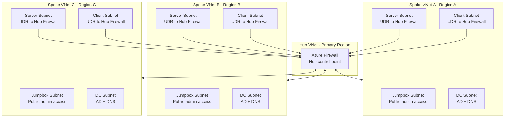
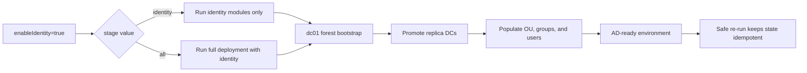
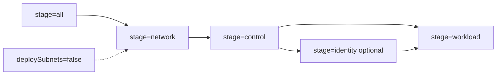
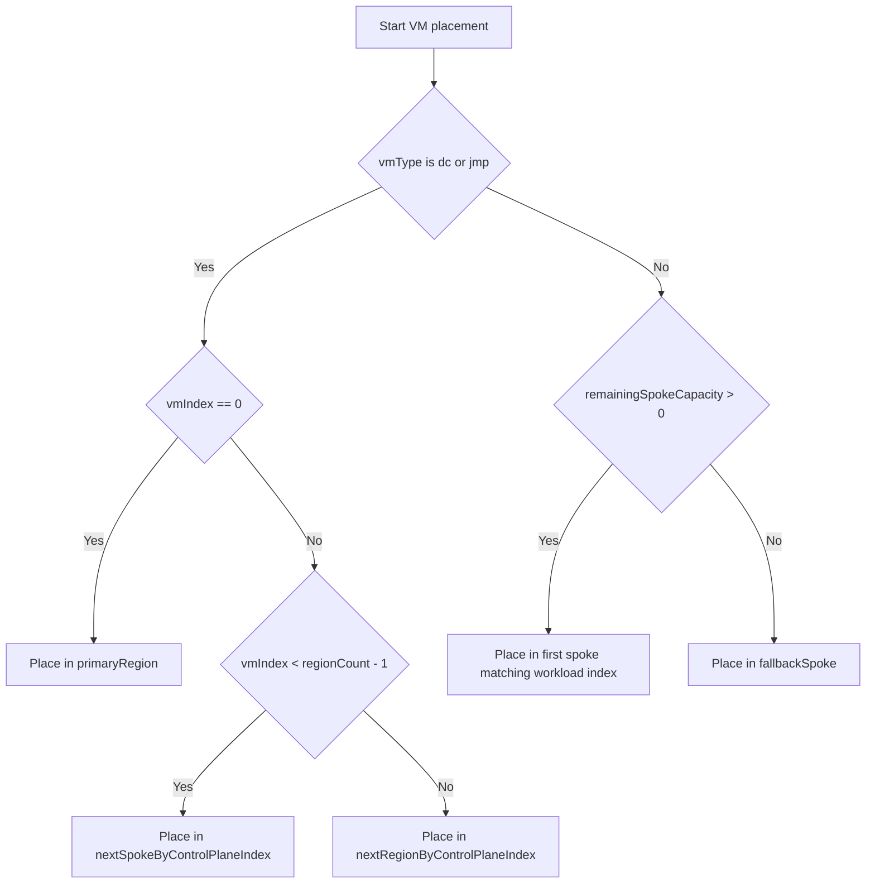
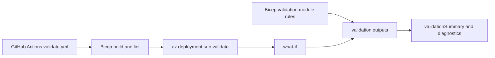

# Azure Multi-Region Lab (AMRL) v2.1

## Overview

This project implements a multi-region Azure lab environment using Bicep. It demonstrates a structured evolution from basic infrastructure deployment into a secure, modular, capacity-aware, and production-aligned platform, now including a staged identity foundation for Active Directory (AD).

The lab is designed to showcase real-world Infrastructure as Code practices, including:

- Deterministic and repeatable deployments  
- Modular architecture using reusable components  
- Secure-by-default design principles  
- Controlled workload distribution across multiple regions  
- Validation-first deployment to detect configuration errors early

Optional identity staging bootstraps AD, promotes replica Domain Controllers (DCs), and performs directory population for OU, group, and user seeding.

For the fastest setup path, go to [Quick Start (Demo Setup)](#quick-start-demo-setup).

---

## Table of Contents

<details>
<summary><strong>Overview</strong></summary>

- [Overview](#overview)
  - [Project Evolution](#project-evolution)
  - [Design Principles](#design-principles)

</details>

<details>
<summary><strong>Design Decisions & Trade-offs</strong></summary>

- [Design Decisions & Trade-offs](#design-decisions--trade-offs)
  - [Deterministic `.4` DNS](#deterministic-4-dns)
  - [Index-Based Placement](#index-based-placement)
  - [Controlled Hub Placement for Control-Plane VMs](#controlled-hub-placement-for-control-plane-vms)
  - [Hub Role Restriction](#hub-role-restriction)
  - [Parallel Deployment Reality](#parallel-deployment-reality)
  - [Global DNS](#global-dns)

</details>

<details>
<summary><strong>Architecture Overview</strong></summary>

- [Architecture Overview](#architecture-overview)
  - [Regional Architecture](#regional-architecture)
  - [Network Architecture](#network-architecture)
    - [Network Architecture Diagram](#network-architecture-diagram)
    - [Traffic Flow](#traffic-flow)
    - [IP Addressing Strategy](#ip-addressing-strategy)
    - [DNS Configuration](#dns-configuration)
    - [DNS Design Approach](#dns-design-approach)
    - [DNS Behaviour](#dns-behaviour)
  - [Identity Architecture](#identity-architecture)
    - [AD Integration](#ad-integration)
    - [Identity Automation Design](#identity-automation-design)
  - [Security Model](#security-model)
  - [Workload Distribution](#workload-distribution)

</details>

<details>
<summary><strong>File Structure</strong></summary>

- [File Structure](#file-structure)
  - [Root Files](#root-files)
  - [Modules](#modules)
    - [Networking](#networking)
    - [Compute](#compute)
    - [Identity](#identity)
    - [Peering](#peering)
    - [Logic](#logic)
  - [Supporting Logic in main.bicep](#supporting-logic-in-mainbicep)
  - [Foundation Layer (External)](#foundation-layer-external)

</details>

<details>
<summary><strong>Start Guide</strong></summary>

- [Quick Start (Demo Setup)](#quick-start-demo-setup)
  - [Required Placeholder Values](#required-placeholder-values)
  - [Quick Demo Steps](#quick-demo-steps)
- [Start Guide (Detailed)](#start-guide-detailed)
  - [Step 1: Understand the Core Concept](#step-1-understand-the-core-concept)
  - [Step 2: Core Deployment Settings](#step-2-core-deployment-settings)
  - [Step 3: Region Mapping](#step-3-region-mapping)
  - [Step 4a: Subnet Mapping](#step-4a-subnet-mapping)
  - [Step 4b: Greenfield and Brownfield Deployments](#step-4b-greenfield-and-brownfield-deployments)
    - [deploySubnets](#deploysubnets)
    - [Greenfield Deployments](#greenfield-deployments)
    - [Brownfield Deployments](#brownfield-deployments)
    - [Relationship Between Stages and Brownfield Deployments](#relationship-between-stages-and-brownfield-deployments)
    - [Stage Dependency Considerations](#stage-dependency-considerations)
    - [Supported Deployment Models](#supported-deployment-models)
  - [Step 5: VM Counts (Controls Scale)](#step-5-vm-counts-controls-scale)
  - [Step 6: Role-Based VM Sizing and Storage](#step-6-role-based-vm-sizing-and-storage)
  - [Step 7: Jumpbox Allowed Sources](#step-7-jumpbox-allowed-sources)
  - [Step 8: Key Vault Setup (Required)](#step-8-key-vault-setup-required)
  - [Step 8a: Identity Foundation Stage (Optional)](#step-8a-identity-foundation-stage-optional)
  - [Step 9: Deploy](#step-9-deploy)
    - [Full Deployment](#full-deployment)
    - [Stages](#stages)
    - [Recommended Deployment Order](#recommended-deployment-order)
  - [Step 10: Validate Results](#step-10-validate-results)

</details>

<details>
<summary><strong>Placement Engine</strong></summary>

- [Placement Engine](#placement-engine)
  - [Rules](#rules)
  - [Placement Decision Flow](#placement-decision-flow)
  - [Why this matters](#why-this-matters)

</details>

<details>
<summary><strong>Validation</strong></summary>

- [Validation](#validation)
  - [CI Workflow Validation (`validate.yml`)](#ci-workflow-validation-validateyml)
  - [Release Workflow (`release.yml`)](#release-workflow-releaseyml)
  - [Bicep Template Validation Rules](#bicep-template-validation-rules)
  - [Bicep Template Validation Outputs](#bicep-template-validation-outputs)

</details>

<details>
<summary><strong>Outputs</strong></summary>

- [Outputs](#outputs)
  - [Core Outputs](#core-outputs)
  - [Purpose](#purpose)
  - [Best Practice](#best-practice)

</details>

<details>
<summary><strong>Licensing</strong></summary>

- [Third-Party Components](#third-party-components)

</details>

<details>
<summary><strong>Future Plans</strong></summary>

- [Future Plans](#future-plans)

</details>

---

## Quick Start (Demo Setup)

Use this section if you want the fastest path to a working demo.

### Required Placeholder Values

The demo parameter template contains these three placeholders:

- `<YOUR_PUBLIC_IP>/32`
- `<SSH_PUBLIC_KEY>`
- `<KEYVAULT_ID>`

### Quick Demo Steps

1. Copy `main.parameters.demo.json` to a local parameters file.
2. Replace the three placeholders listed above in your local parameters file.
3. Create an Azure Key Vault (Key Vault) (if you do not already have one) and add these secrets:
  - `jumpboxAdminPassword`
  - `serverAdminPassword`
  - `clientAdminPassword`
   See [Step 8: Key Vault Setup (Required)](#step-8-key-vault-setup-required) for required configuration.
4. Deploy locally:

```bash
az deployment sub create \
  --name demo-deployment \
  --location westeurope \
  --template-file main.bicep \
  --parameters <your-local-parameters-file>.json
```

For full parameter-by-parameter guidance, continue with [Start Guide (Detailed)](#start-guide-detailed).

Identity note: `main.parameters.demo.json` keeps `enableIdentity` disabled by default for fast baseline demos.

Identity notes:

- `stage=identity` is not a standalone first-run path; control-plane DC VMs must already exist (or use `stage=all`).
- Current identity scope includes forest bootstrap, replica promotion, and directory population for OU, group, and user seeding.
- Domain join and related hardening remain future work.

### Project Evolution

The solution was developed iteratively, with each phase introducing additional architectural capability:

- **v1.0 — IaC Baseline**  
  Introduced the initial Bicep-based multi-region deployment baseline with static Azure Virtual Network (VNet) peering and CLI-driven execution.

- **v1.5 — Automation and Validation**  
  Standardised and automated subscription-scope deployments with repeatable validation and cross-region connectivity testing.

- **v1.6 — Core Network Foundation**  
  Multi-region networking, subnet segmentation, and DNS structure.

- **v1.7 — Security and Modularity**  
  Network Security Groups (NSGs), role-based segmentation, and VNet peering.

- **v1.8 — Modular Architecture**  
  Separation of components into reusable modules and integration with Key Vault.

- **v1.9 — Security Hardening and Identity**  
  Introduction of a jumpbox model, private-only workloads, hub firewall routing, and hardened authentication.

- **v1.10 — Placement and Validation Engine**  
  Deterministic Virtual Machine (VM) placement, predictable network addressing, capacity-aware distribution, route-table driven traffic control, and pre-deployment validation.

- **v1.11 — Hub-Spoke Networking**  
  Hub-and-spoke VNet peering combined with centralised firewall-based routing, spoke route tables, and refined network flow control across regions.

- **v1.12 — Stage-Based Deployment Control**  
  Introduced stage-based deployment orchestration (`network`, `control`, `workload`, `all`) and refined subnet/firewall index handling to support safer incremental and brownfield-aligned deployment flows.

- **v1.13.1 — Role-Based VM Sizing and Storage**  
  Role-based compute sizing and OS disk configuration (`vmSizes`, `osDisks`) with per-role disk size support.

- **v1.13.2 — GitHub Actions and CI/CD Foundation**  
  Introduced GitHub Actions CI/CD with Azure OpenID Connect (OIDC) authentication, Bicep build/lint checks, deployment validation, What-If integration, and a demo deployment profile.

- **v2.0.0 — Identity Foundation**
  Introduced staged Active Directory (AD) deployment with `enableIdentity`, `domainName`, `stage=identity`, automated forest creation on the primary DC, automated replica DC promotion, and reusable PowerShell-based identity orchestration using Azure VM Run Command.

- **v2.1.0 — Directory Population**
  Added staged directory population to the identity workflow, including OU creation, AGDLP group seeding, share and NTFS permission provisioning, brownfield manager reconciliation, and user population driven by `departments`, `departmentCount`, and `usersPerDepartment`.

### Design Principles

The design is based on the following principles:

- **Deterministic deployment**  
  The same inputs always produce the same infrastructure layout.

- **Separation of concerns**  
  Networking, compute, security, and placement logic are clearly separated.

- **Data-driven design**  
  Deployment behaviour is controlled through parameter configuration.

- **Validation before deployment**  
  Invalid configurations are detected and blocked early.

- **Balanced multi-region distribution**  
  Workloads are evenly distributed while respecting regional constraints.

- **Security-first approach**  
  Minimal exposure, controlled access paths, and secure credential handling.

[Back to top](#table-of-contents)
---

## Design Decisions & Trade-offs

### Deterministic `.4` DNS
Use `.4` from each DC subnet for DNS.

- Benefit: Predictable and valid.  
- Limitation: Not all DC IPs are listed.  

### Index-Based Placement
Placement uses deterministic indexing and derived remaining spoke capacity instead of runtime capacity tracking.

- Benefit: Repeatable.  
- Benefit: Prevents workloads from being assigned to spokes already filled by control-plane VMs.  
- Limitation: Deterministic, not runtime-aware.  

### Controlled Hub Placement for Control-Plane VMs
The first DC and jumpbox are pinned to the hub region.  
Additional DCs and jumpboxes are placed in spokes first, with the hub used as a fallback.

- Benefit: Guarantees control-plane presence in the hub.  
- Benefit: Distributes additional instances for resilience.  
- Benefit: Protects limited hub capacity.  
- Benefit: Allows additional hub placement when capacity permits.  
- Limitation: Based on index ordering, not real-time capacity.  

### Hub Role Restriction
Only DCs and jumpboxes are allowed in the hub.

- Benefit: Clear control-plane separation.  
- Benefit: Improved security posture.  
- Limitation: Reduces general capacity in the hub.  

### Parallel Deployment Reality
Placement does not rely on deployment order.

- Benefit: Deterministic behaviour.  
- Limitation: Must account for concurrent deployments.  

### Global DNS
All VNets share the same DNS list derived from DC placement.

- Benefit: Simple and consistent.  
- Limitation: Not latency-optimised per region.  

[Back to top](#table-of-contents)
---

## Architecture Overview

The deployment creates a consistent infrastructure footprint across multiple Azure regions.

### Regional Architecture

Each selected region contains:

- A dedicated Resource Group (RG)  
- A VNet  
- Segmented subnets:
  - DC (dc)
  - Server
  - Client
  - Jumpbox  
- NSGs applied per subnet  
- VMs based on configured roles  

### Network Architecture

- Spoke server and client subnets use User-Defined Routes (UDRs) to direct traffic through the hub firewall
- Hub firewall provides centralised east-west traffic inspection and acts as the control point for inter-region communication
- Controlled administrative access via regional jumpboxes (only tier with public exposure)
- Subnet-level traffic segmentation enforced using NSGs

This design enforces centralised security by preventing direct spoke-to-spoke communication and routing all inter-network traffic through the hub firewall.

#### Network Architecture Diagram



Traffic path: Spoke VM -> UDR -> Hub Firewall -> Destination Spoke VM (no direct spoke-to-spoke path).

#### Traffic Flow

Spoke workloads do not talk directly to each other by default. Instead:

- Server and client subnets in spoke regions use route tables to send internal traffic to the hub firewall
- The hub firewall applies the central routing and security control point
- Jumpboxes remain the entry point for administration
- NSGs still enforce subnet-level access rules

#### IP Addressing Strategy

All VMs use **Dynamic private IP allocation**.

DCs are deployed into dedicated **DC subnets per region**. Azure assigns IP addresses deterministically within each subnet:

- `.0–.3` are reserved by Azure  
- `.4` is the first usable IP address  

Because DCs are deployed first into their subnets, each region’s primary DC consistently receives the `.4` address.

This removes the need for complex static IP calculations while maintaining predictable addressing.

#### DNS Configuration

Each VNet is configured with up to three DNS servers, using deterministic `.4` addresses from DC subnets.

The DNS server list is derived dynamically from DC placements and ordered as follows:

1. The hub region DC (`.4`) is prioritised when present
2. Remaining regions containing DCs are included in deterministic order
3. The list is truncated to a maximum of three DNS servers

This same ordered DNS server list is applied consistently across all VNets.

#### DNS Design Approach

DNS configuration is based on deterministic infrastructure behaviour rather than dynamic discovery:

- Bicep does not support runtime lookup of assigned IP addresses
- Each DC subnet is isolated and contains only DCs
- The first deployed VM in each subnet always receives `.4`
- DCs are deployed first, ensuring correct assignment

#### DNS Behaviour

- DNS order is hub-first, then remaining DC regions
- Each VNet may have between one and three DNS entries depending on DC placement and region count
- DNS redundancy is maintained by including multiple regional DCs when available

### Identity Architecture

When `enableIdentity=true`, the solution deploys a multi-DC AD environment.

Identity deployment currently supports:

- Greenfield deployments
- Brownfield identity activation
- Multi-region AD DC replication
- Idempotent identity deployments

Identity deployment behaviour:

- `dc01` creates the AD forest and DNS infrastructure.
- Additional DCs are promoted as replica DCs.
- Directory population runs on the primary DC after forest bootstrap and replica promotion complete.
- Identity deployments are idempotent and can be safely re-executed.
- Identity deployment is automatically included in `stage=all` when `enableIdentity=true`.

#### Identity Deployment Flow

Use this flow to understand how `enableIdentity` and `stage` determine forest bootstrap, replica promotion, and directory population.



#### AD Integration

After AD DS installation:

- DCs automatically register themselves in DNS
- Clients can discover all DCs using AD-integrated DNS

#### Identity Automation Design

Identity automation uses Azure VM Run Command resources rather than Custom Script Extensions.

Benefits:

- No Azure Storage Account dependency
- No SAS token management
- No runtime dependency on GitHub access
- Compatible with isolated or restricted networking environments
- Scripts remain version-controlled within the repository

PowerShell scripts are embedded into Azure VM Run Command resources at deployment time using Bicep `loadTextContent()`.

#### Directory Population

The identity stage performs:

- OU creation
- Department OU creation
- AGDLP group creation
- Share creation
- NTFS permission assignment
- Manager population
- User population

Configuration is deployment-driven through parameters:

- departments
- departmentCount
- usersPerDepartment

Behaviour notes:

- Populate logic is executed through Azure VM Run Command with script content embedded from the repository using Bicep `loadTextContent()`.
- Deployments are intentionally non-destructive: reruns reconcile existing objects and recreate only missing required objects.

Greenfield expectations:

- Baseline OUs, departmental OUs, security groups, AGDLP nesting, shares, and NTFS ACLs are created.
- User population targets are applied per department as `1 manager + usersPerDepartment standard users`.

Brownfield reconciliation model:

- Departmental context is OU-driven: OU location determines department ownership during remediation.
- Manager eligibility is title-driven within that OU context: accounts are treated as managers only when title matches `*Manager*`.
- Exactly one manager is supported per department. If multiple managers exist, the first is retained and additional managers are demoted.
- If no manager exists in a department, a new manager is created from an unused CSV record (existing users are not promoted).
- Removing a department from `departments` does not delete its existing OU or users; that OU remains and becomes unmanaged by subsequent runs.
- Adding a new department to `departments` creates and reconciles that department in addition to already existing departments.
- Reporting lines are repaired from departmental context:
  - unmanaged users are assigned to the departmental manager
  - invalid or cross-department manager links are reassigned to the departmental manager
- Non-manager users are remediated for Department attribute and departmental group memberships.

Population rules:

- `usersPerDepartment` is enforced as a minimum target for standard users (managers excluded from this count).
- Under-populated departments are topped up.
- Over-populated departments are preserved; surplus users are not removed.
- New users are added round-robin across departments.
- Username collisions are skipped.
- Standard user population stops with a warning when unique names are exhausted.
- Manager bootstrap fails for a department if no unique CSV name remains.

### Security Model

- Public access is restricted to jumpboxes only  
- All other VMs are private  
- Role-based NSG rules control traffic flow  
- Credentials are securely stored in Key Vault  

### Workload Distribution

- DCs are placed first using deterministic rules  
- Server and client VMs (workloads) are always placed on spoke regions  
- Additional control-plane VMs (DCs and jumpboxes) use spoke-first placement, then may use the hub after the first spoke pass  
- Each region is constrained by a maximum VM limit to prevent over-allocation  

[Back to top](#table-of-contents)
---

## File Structure

The project is structured to separate concerns and promote modular reuse.

### Root Files

- **main.bicep**  
  Entry point for the deployment. Defines orchestration, placement logic, and module calls.

- **main.parameters.demo.json**  
  Demo parameter template used as the base for local testing and by GitHub Actions validation (`validate.yml`).

- **main.parameters.example.json**  
  Full reference file with placeholders and defaults for all tunable values.

### Modules

#### Networking

- **modules/networking/vnet.bicep**  
  Deploys VNets, integrates subnets, configures DNS, and supports both greenfield and brownfield network reuse.

- **modules/networking/subnet.bicep**  
  Defines individual subnet resources.

- **modules/networking/nsg.bicep**  
  Deploys NSGs with role-based rules.

- **modules/networking/firewall.bicep**  
  Deploys the hub firewall and policy-based rule collections.

- **modules/networking/routeTable.bicep**  
  Attaches UDRs to spoke subnets so traffic reaches the hub firewall.

---

#### Compute

- **modules/compute/vm-windows.bicep**  
  Deploys Windows VMs, including DCs, servers, clients, and jumpboxes.

- **modules/compute/vm-linux.bicep**  
  Deploys Linux VMs with SSH-based authentication.

---

#### Identity

- **modules/identity/ad-forest.bicep**
  Deploys forest bootstrap automation to the primary DC.

- **modules/identity/ad-replicadc.bicep**
  Deploys replica promotion automation to all additional DCs.

- **modules/identity/ad-populate.bicep**
  Deploys directory population automation to the primary DC.

- **modules/identity/scripts/Install-Forest.ps1**
  Creates the AD forest and DNS infrastructure.

- **modules/identity/scripts/Promote-ReplicaDC.ps1**
  Promotes additional DCs into the existing forest.

- **modules/identity/scripts/Populate-AD.ps1**
  Performs idempotent directory OU, group, share and user population.

---

#### Peering

- **modules/peering/peering.bicep**  
  Configures hub-to-spoke and spoke-to-hub VNet peering.

---

#### Logic

- **modules/logic/validation.bicep**  
  Evaluates placement and configuration checks and emits validation outputs used by `main.bicep`.

### Supporting Logic in main.bicep

- **VM Model Construction**  
  Builds a unified list of all VM types and counts

- **Region Ordering Logic**  
  Converts region mappings into a deterministic ordered list

- **Placement Engine**  
  Assigns each VM to a region using role-aware deterministic placement with explicit hub pinning and spoke-first control-plane behaviour

- **Validation Engine**  
  Invokes `modules/logic/validation.bicep` and surfaces validation outputs at the top level

- **Identity Foundation**  
  Enables identity bootstrap using `enableIdentity` and `domainName`, deploys forest creation to the primary DC, orchestrates replica promotion modules, and runs directory population.

### Foundation Layer (External)

- Key Vault (must exist before deployment)  
- Stores admin credentials securely  
- Referenced directly from the parameter file

[Back to top](#table-of-contents)
---

## Start Guide (Detailed)

Use this section when you want full control over the deployment configuration.
If you only need a working demo, use [Quick Start (Demo Setup)](#quick-start-demo-setup).
---

### Step 1: Understand the Core Concept

This deployment spreads VMs across multiple Azure regions while ensuring:

- No region gets too many VMs
- Distribution is balanced
- Certain roles (like DCs) are placed intentionally

You control this behaviour with values in a parameter file.
Start by copying `main.parameters.demo.json` to a local parameters file, then edit that local file with your own values.


[Back to top](#table-of-contents)
---

### Step 2: Core Deployment Settings

```json
"prefix": { "value": "AMRL" },
"regionCount": { "value": 3 },
"maxVmsPerRegion": { "value": 2 }
```

#### prefix
- Used to name all resources (e.g. `yourprefix-rg-<azure-region>`)
- Change this to something meaningful for your lab or project

#### regionCount
- How many regions will be used
- MUST be less than or equal to the number of regions in `regionIndexMap`

#### maxVmsPerRegion
- The **maximum number of VMs allowed in each region**
- Manual pre-check guidance: Use this to help plan around Azure CPU quotas. The template enforces VM count limits, not vCPU quota checks.

Example:
If each VM uses 2 vCPUs and quota is 4:
```
maxVmsPerRegion = 2
```


[Back to top](#table-of-contents)
---

### Step 3: Region Mapping

For example:

```json
"regionIndexMap": {
  "value": {
    "southafricanorth": 1,
    "australiaeast": 2,
    "australiasoutheast": 3,
    "austriaeast": 4,
    "belgiumcentral": 5
  }
}
```

#### Step 3: What this does

- Defines WHICH regions are available
- Defines the ORDER of regions

#### Step 3: Why order matters

The placement engine uses this order to distribute VMs.

#### Step 3: Rules

- Must start at `1`
- Must increase by `1` each time
- No gaps allowed

[Back to top](#table-of-contents)
---

### Step 4a: Subnet Mapping

```json
"subnetIndexMap": {
  "value": {
    "firewall": 0,
    "jumpbox": 1,
    "dc": 2,
    "server": 3,
    "client": 4
  }
}
```

#### Step 4a: What this does

Defines how subnets are created and ordered within each region.

The numbering determines:
- The firewall subnet index used for AzureFirewallSubnet in the hub VNet
- The logical order of subnets
- The subnet index used when calculating IP address ranges

#### Step 4a: Recommendation

Leave these values as-is unless redesigning networking.

[Back to top](#table-of-contents)
---

### Step 4b: Greenfield and Brownfield Deployments

### `deploySubnets`

```json
"deploySubnets": { "value": true }
```

This parameter controls whether networking resources are created or reused.

| Value | Behaviour |
|---------|------------|
| `true` | Creates NSGs, subnets, and the Azure Firewall subnet. |
| `false` | Reuses existing networking resources instead of creating them. |

### Greenfield Deployments

A greenfield deployment creates all networking components required by the solution:

- VNets
- Subnets
- NSGs
- Azure Firewall subnet
- Route tables
- VMs

For new lab environments, leave `deploySubnets` set to `true`.

### Brownfield Deployments

A brownfield deployment reuses existing networking resources rather than creating new ones.

This solution supports deployment framework-managed brownfield scenarios, including:

- Redeployment of an existing environment.
- Recovery or rebuild of VMs.
- Incremental deployment of additional workloads.
- Separate execution of the `network`, `control`, `identity`, and `workload` stages within environments created and managed by this deployment framework.

The existing networking resources should either:

- Have been created by a previous deployment of this solution, or
- Follow the same naming conventions, subnet structure, and resource relationships expected by the modules.


### Relationship Between Stages and Brownfield Deployments

Stages and brownfield support serve different purposes:

| Feature | Purpose |
|----------|---------|
| `stage` | Controls when resources are deployed |
| `deploySubnets` | Controls whether networking resources are created or reused |

Examples:

- `stage=network` → Deploy networking only.
- `stage=control` → Deploy control-plane VMs (DCs and jumpboxes) only.
- `stage=identity` → Deploy identity bootstrap and replica promotion modules (requires existing control-plane DC VMs).
- `stage=workload` → Deploy workload VMs only.
- `deploySubnets=false` → Reuse existing networking resources.

#### Stage Dependency Diagram

Use this as a quick reference for valid staged deployment sequences and prerequisites.



These features can be used independently or together, provided the required networking resources and deployment framework assumptions are already in place.

### Parameters That Can Be Changed Between Deployments

The following changes are generally supported:

- VM counts (`vmCounts`)
- VM sizes (`vmSizes`)
- OS disk settings (`osDisks`)
- Operating system images (`windowsServerImage`, `windowsClientImage`, `ubuntuImage`)
- Administrative credentials
- SSH public keys
- Tags
- Jumpbox access restrictions (`jumpboxAllowedSources`)
- Client SSH settings (`enableClientSsh`)
- VM auto-delete settings (`vmAutoDeleteOptions`)
- Deployment stage (`stage`)

Typical examples include:

- Increasing workload VM counts
- Adding additional DCs
- Updating operating system images
- Resizing VMs

### Changes Requiring Careful Planning

The following parameters may significantly affect topology or addressing:

- `prefix`
- `regionCount`
- `regionIndexMap`
- `subnetIndexMap` (including the `firewall` index)

Changing these values after deployment may require resource recreation or migration planning.

### Current Limitation

This solution is designed around the networking structure produced by its own modules.

The following scenarios are not currently supported without additional customisation:

- Existing corporate VNets with different subnet structures
- Existing NSGs with different naming conventions
- Networking environments created by unrelated templates
- Arbitrary existing network topologies

### Stage Dependency Considerations

Control and workload deployments rely on networking structures defined by this deployment framework. Identity stage deployments additionally rely on existing control-plane DC VMs. While the stages can be executed independently after prerequisites are established, the current implementation is not intended for deploying compute resources into arbitrary pre-existing networking environments without additional customisation.

### Supported Deployment Models

| Scenario | Supported |
|-----------|-----------|
| Greenfield deployment | Yes |
| Full deployment (`stage=all`) | Yes |
| Staged deployment (`network → control → identity → workload`) within framework-managed environments | Yes |
| Redeploy existing environment created by this framework | Yes |
| Reuse existing networking that follows the framework structure | Yes |
| Disaster recovery and VM rebuilds | Yes |
| Modify VM counts, role-based sizes/disks, images, tags, and access settings | Yes |
| Deploy into arbitrary existing networking | No |

Example brownfield workflow:

Day 1:
- stage=network
- stage=control
- stage=workload

Day 30:
- enableIdentity=true
- stage=identity

Result:
- Forest created
- Replica DCs promoted
- Existing infrastructure retained

### Design Principle

The VNet module (`vnet.bicep`) is the authoritative source of truth for subnet and NSG identity:

- Subnet naming and baseline creation
- NSG creation
- Subnet IDs
- NSG IDs

The route table module applies spoke subnet route table associations after VNet baseline creation. This keeps naming/ID derivation centralised while allowing staged networking updates.

For implementation details, see [Networking](#networking) and [Supporting Logic in main.bicep](#supporting-logic-in-mainbicep).

[Back to top](#table-of-contents)
---

### Step 5: VM Counts (Controls Scale)

```json
"vmCounts": {
  "value": {
    "dc": 1,
    "jumpbox": 1,
    "windowsServer": 1,
    "windowsClient": 1,
    "linuxServer": 1,
    "linuxClient": 1
  }
}
```

#### Step 5: What this does

Defines HOW MANY VMs of each type to create.

### Important behaviour

- DCs and jumpboxes are control-plane VMs and are placed before server and client VMs (workloads)
- The first DC (`dc01`) and first jumpbox (`jmp01`) are pinned to the hub (primary region)
- Additional control-plane VMs follow spoke-first placement, with the hub used as a fallback
- Server and client VMs (workloads) are always placed on spokes, never in the hub

### How to change safely

If you increase VM counts:

Ensure:
```
totalVMs ≤ regionCount × maxVmsPerRegion
```

[Back to top](#table-of-contents)
---

### Step 6: Role-Based VM Sizing and Storage

For example:

```json
"vmSizes": {
  "value": {
    "dc": "Standard_B2ms",
    "jumpbox": "Standard_B2s_v2",
    "windowsServer": "Standard_B2s_v2",
    "windowsClient": "Standard_B2ls_v2",
    "linuxServer": "Standard_B2s_v2",
    "linuxClient": "Standard_B1ms"
  }
},
"osDisks": {
  "value": {
    "dc": {
      "storageAccountType": "Premium_LRS",
      "diskSizeGB": 128
    },
    "jumpbox": {
      "storageAccountType": "StandardSSD_LRS",
      "diskSizeGB": 64
    },
    "windowsServer": {
      "storageAccountType": "Premium_LRS",
      "diskSizeGB": 128
    },
    "windowsClient": {
      "storageAccountType": "StandardSSD_LRS",
      "diskSizeGB": 64
    },
    "linuxServer": {
      "storageAccountType": "Premium_LRS",
      "diskSizeGB": 128
    },
    "linuxClient": {
      "storageAccountType": "StandardSSD_LRS",
      "diskSizeGB": 64
    }
  }
}
```

#### Step 6: What this does

Defines VM size and OS disk settings per role.

- `vmSizes` controls CPU and memory by role.
- `osDisks.storageAccountType` controls the disk performance tier by role.
- `osDisks.diskSizeGB` controls OS disk capacity by role.

#### Step 6: Supported OS disk properties

- `storageAccountType`
- `diskSizeGB`

#### Step 6: Why this matters

This enables right-sizing by role instead of forcing all VMs to use one shared compute profile.

Manual pre-check: Azure regional vCPU quota still applies. Plan role choices according to subscription quota and target region limits.

#### Step 6: VM lifecycle behaviour

The `vmAutoDeleteOptions` parameter controls whether dependent resources are automatically deleted when a VM is deleted.

```json
"vmAutoDeleteOptions": {
  "value": {
    "nic": true,
    "publicIp": true,
    "osDisk": true
  }
}
```

With the default values above:

- NICs are automatically deleted when VMs are deleted.
- Public IPs are automatically deleted when VMs are deleted.
- OS disks are automatically deleted when VMs are deleted.

[Back to top](#table-of-contents)
---

### Step 7: Jumpbox Allowed Sources

```json
"jumpboxAllowedSources": {
  "value": [
    "<YOUR_PUBLIC_IP>/32"
  ]
}
```

#### Step 7: What this does

Defines the list of public IP addresses or ranges that are allowed to access the jumpboxes via RDP. These values are used to configure inbound NSG rules, restricting administrative access to only the specified sources.

In `main.parameters.demo.json`, this value is a placeholder. Replace it in your local parameters file with your own public IP address.

#### Jumpbox access notes

- Replace this example value with your own public IP address
- If not configured correctly, you will not be able to access the jumpboxes
- Jumpboxes are the only entry point to access the rest of the VMs in the environment

[Back to top](#table-of-contents)
---

### Step 8: Key Vault Setup (Required)

### Why Key Vault is needed

Passwords are NOT stored in the template. They are securely stored in Key Vault.

### Create Foundation RG

```bash
az group create --name <foundation-rg> --location <azure-region>
```

Ensure that the name of this RG does not start with the prefix selected earlier, as it will also be deleted if a bulk RG deletion command is used to clean up the lab.

### Create Key Vault

Ensure that the correct Azure Role-Based Access Control (RBAC) role is assigned to create the key vault and secrets. For example: [Key Vault Secrets Officer](https://learn.microsoft.com/en-us/azure/role-based-access-control/built-in-roles/security#key-vault-secrets-officer)

```bash
az keyvault create \
  --name <key-vault-name> \
  --resource-group <foundation-rg> \
  --location <azure-region> \
  --enabled-for-template-deployment true
```

### Add Secrets

```bash
az keyvault secret set --vault-name <key-vault-name> --name jumpboxAdminPassword --value <password>
az keyvault secret set --vault-name <key-vault-name> --name serverAdminPassword --value <password>
az keyvault secret set --vault-name <key-vault-name> --name clientAdminPassword --value <password>
```

### Link Key Vault in Parameters

```json
"jumpboxAdminPassword": {
  "reference": {
    "keyVault": {
      "id": "<KEYVAULT_ID>"
    },
    "secretName": "jumpboxAdminPassword"
  }
}
```

Repeat for other passwords.

#### Required Key Vault Configuration

This solution uses Azure Resource Manager Key Vault references for secure password retrieval.

To support local and GitHub Actions validation, the Key Vault must allow Azure Resource Manager access.

##### Enable Azure Service Bypass

```bash
az keyvault update \
  --name <key-vault-name> \
  --bypass AzureServices
```

##### Enable ARM Template Deployment Access

```bash
az keyvault update \
  --name <key-vault-name> \
  --enabled-for-template-deployment true
```

##### Verify Configuration

```bash
az keyvault show \
  --name <key-vault-name> \
  --query "{TemplateDeployment:properties.enabledForTemplateDeployment,Bypass:properties.networkAcls.bypass}"
```

Expected result:

```json
{
  "TemplateDeployment": true,
  "Bypass": "AzureServices"
}
```

Reference: [Use Azure Key Vault to pass secure parameter values during deployment](https://aka.ms/arm-keyvault)

Related: [CI Workflow Validation (`validate.yml`)](#ci-workflow-validation-validateyml)

[Back to top](#table-of-contents)
---

### Step 8a: Identity Foundation Stage (Optional)

Use this stage when you want to bootstrap AD forest creation, replica promotion, and directory population.

Required parameters:

```json
"enableIdentity": { "value": true },
"domainName": { "value": "amrl.lab" },
"usersPerDepartment": { "value": 50 },
"departments": { "value": { "Finance": "FIN" } },
"departmentCount": { "value": 1 }
```

Important behaviour:

- `enableIdentity=true` enables identity modules.
- `stage=identity` runs identity modules only.
- Identity resources deploy after control-plane DC VMs exist.
- Forest creation runs only on the primary DC.
- Replica promotion runs only on additional DCs.
- Directory population runs on the primary DC after forest and replica steps.
- Identity deployments are idempotent and can be safely re-executed.
- `stage=all` automatically executes identity deployment when `enableIdentity=true`.

Department parameter behaviour:

- `departments` is an object that maps department names to short codes, for example `"Finance": "FIN"`.
- `departmentCount` limits how many entries are taken from `departments` during a deployment.
- `usersPerDepartment` controls the target number of standard users per department.
- Existing departments are reconciled in place; missing required objects are recreated.
- Departments removed from the parameter set are not deleted; they remain present but unmanaged by further population runs.
- Departments newly added to the parameter set are created and managed alongside existing departments.
- For full greenfield and brownfield reconciliation behaviour, see [Directory Population](#directory-population).

[Back to top](#table-of-contents)
---

### Step 9: Deploy

The solution supports both full and staged deployments through the `stage` parameter.

### Full Deployment

Deploy all networking and compute resources (and identity resources when `enableIdentity=true`):

```bash
az deployment sub create \
  --name <deployment-name> \
  --location <azure-region> \
  --template-file main.bicep \
  --parameters <your-local-parameters-file>.json
```

Provide `stage` explicitly in your parameters file (or via `--parameters stage=<value>`).

Example in a parameters file:

```json
"stage": {
  "value": "all"
}
```

### Stages

Deploy only networking resources:

```bash
--parameters stage=network
```

Deploy only control-plane VMs (DCs and jumpboxes):

```bash
--parameters stage=control
```

Deploy identity bootstrap, replica promotion, and directory population:

```bash
--parameters stage=identity --parameters enableIdentity=true
```

Deploy only workload VMs:

```bash
--parameters stage=workload
```

### Recommended Deployment Order

For staged deployments:

```text
1. network
2. control
3. identity (optional, requires `enableIdentity=true`)
4. workload
```

For complete deployments (`stage=all`), this order is handled automatically by the solution.

For tag-based GitHub release creation, see [Release Workflow (`release.yml`)](#release-workflow-releaseyml).

[Back to top](#table-of-contents)
---

### Step 10: Validate Results

After deployment (or during development validation), review the outputs to confirm correctness and troubleshoot issues.

### Key Outputs

- `vmPlacement`  
  Shows where each VM is deployed across regions.  
  Use this to verify deterministic placement logic.

- `vmCountPerRegion`  
  Displays VM distribution per region.  
  Confirms that no region exceeds capacity limits.

- `validationSummary`  
  Provides a concise one-line validation status (`Validation passed.` or first detected validation issue).

- `validationMessage`  
  Provides a human-readable explanation of the first validation failure (empty if valid).

- `validationDebug`  
  Displays detailed validation flags for all rules.  
  Useful during development to identify exactly which condition failed.

- `validationCapacityDebug`  
  Shows non-control VM demand versus remaining spoke workload capacity.

- `validationWorkloadCapacityDebug`  
  Shows per-region control-plane occupancy and remaining workload slots.

- `capacityCheck`  
  Shows total requested VMs vs total available capacity.

### How to Use These Outputs

1. Check `validationSummary` for a quick pass/fail status  
2. Review `validationMessage` for the first detected issue when validation fails  
3. Use `validationDebug` to identify exactly which validation rule failed  
4. Use `validationCapacityDebug` to confirm that non-control demand fits within remaining spoke workload capacity  
5. Use `validationWorkloadCapacityDebug` to inspect how control-plane (DC and jumpbox) placement consumed spoke slots  
6. Review `vmPlacement` and `vmCountPerRegion` to validate distribution logic  
7. Verify core configuration inputs if results are unexpected: VM sizes vs regional quota, `regionCount` vs available regions, and `vmCounts` vs total capacity.  

### Validation Mode Note

During development, validation errors are exposed via outputs instead of blocking deployment.  
In production scenarios, assertions can be enabled to prevent invalid deployments.
---

## Placement Engine

### Rules

1. dc01 → pinned to primary region
2. jmp01 → pinned to primary region
3. non-control VMs (not dc/jmp) → always placed on spoke regions (never hub)
4. additional control-plane VMs (DCs and jumpboxes) → prefer spokes first, then may use hub after the first spoke pass
5. workloads consume only remaining spoke capacity after control-plane placement

For architecture-level context, see [Workload Distribution](#workload-distribution).

Note: Bicep does not track real-time regional capacity during deployment. The template uses deterministic placement plus a derived remaining-capacity model built from planned control-plane placements, not live Azure runtime state.


[Back to top](#table-of-contents)
---

### Placement Decision Flow

Use this decision tree to map VM type and index inputs to final region placement.


---

### Why this matters

- Control-plane placement stays deterministic (dc01 and jmp01 pinned to hub)
- Non-control workloads are always excluded from hub
- Workloads cannot spill into a spoke that is already full from control-plane placement
- Regional spread remains predictable and capacity checks still apply

[Back to top](#table-of-contents)
---

## Validation

This solution has two distinct validation layers:

- CI workflow validation (GitHub Actions) in `validate.yml`
- Bicep template validation logic in `modules/logic/validation.bicep` and top-level outputs

### Validation Pipeline Diagram

Use this diagram to see how CI checks and template validation rules converge into deployment diagnostics.



### CI Workflow Validation (`validate.yml`)

If you are using GitHub Actions, this repository includes `.github/workflows/validate.yml`.

- It runs on pushes to `main`, pushes to `feature/**`, and pull requests targeting `main`.
- It builds/lints `main.bicep`, injects values for the three placeholders, then runs `az deployment sub validate` and `what-if` using `main.parameters.demo.json`.

#### GitHub Actions Prerequisites

The validation workflow uses Azure OpenID Connect (OIDC) and Azure Resource Manager deployment validation.

##### Required GitHub Secrets

Set these repository secrets:

- AZURE_CLIENT_ID
- AZURE_TENANT_ID
- AZURE_SUBSCRIPTION_ID
- SSH_PUBLIC_KEY

##### Required GitHub Variables

Set these repository variables:

- KEYVAULT_ID
- YOUR_PUBLIC_IP

##### Azure Service Principal

Create an Azure App Registration and Service Principal for GitHub Actions with at least Contributor role on the target subscription.

##### Federated Credentials (OIDC)

Configure Federated Credentials on the App Registration to match workflow trigger subjects:

- `main`
- `feature/**`

At minimum, configure `main`. For feature branches, use branch-specific credentials. Validation will fail if credentials are not created when moving to a new branch.

##### References

- [GitHub Actions Workflow Syntax](https://docs.github.com/en/actions/writing-workflows/workflow-syntax-for-github-actions)
- [Azure Login GitHub Action](https://github.com/Azure/login)
- [Azure OIDC Authentication for GitHub Actions](https://learn.microsoft.com/azure/developer/github/connect-from-azure-openid-connect)
- [Create GitHub OIDC Federated Credentials in Microsoft Entra ID](https://learn.microsoft.com/entra/workload-id/workload-identity-federation-create-trust)
- [GitHub Actions Status](https://www.githubstatus.com)

#### Trial Subscription Note

Some VM sizes used by the reference architecture may not be available in Azure Trial or Student subscriptions. The GitHub Actions What-If stage may report SKU availability errors depending on subscription type and regional capacity.

### Release Workflow (`release.yml`)

If you are using GitHub Releases, this repository includes `.github/workflows/release.yml`.

- It runs when a tag matching `v*` is pushed (for example, `v1.13.3`).
- It requires `contents: write` permission to create the release.
- It uses `softprops/action-gh-release@v2` with generated release notes enabled.

Typical release flow:

```bash
git tag v1.13.3
git push origin v1.13.3
```

Reference: [softprops/action-gh-release](https://github.com/softprops/action-gh-release)

### Bicep Template Validation Rules

The following checks are performed:

- Minimum required VM counts (at least 1 DC and 1 jumpbox)  
- Region count does not exceed available mappings  
- Primary pinning is enforced (`dc01` and `jmp01` must be in the primary region)  
- Non-control VMs (server/client roles) are not allowed in the hub region  
- Total VM count does not exceed regional capacity  
- Non-control VM demand must fit within remaining spoke capacity after control-plane (DC and jumpbox) placement  
- All regions defined in `regionKeys` exist in `regionIndexMap`  
- Subnet index map includes required roles (firewall, dc, jumpbox, server, client)  
- Region index values are continuous and start at 1  
- No region exceeds the maximum VM capacity  
- DC distribution fits within region constraints  
- `vmSizes` includes all required role keys (dc, jumpbox, windowsServer, windowsClient, linuxServer, linuxClient)  
- `osDisks` includes all required role keys (dc, jumpbox, windowsServer, windowsClient, linuxServer, linuxClient)  

### Bicep Template Validation Outputs

Validation results are exposed using:

- `validationSummary` → concise status string (`Validation passed.` or first detected validation issue)  
- `validationMessage` → first detected validation issue, or `All validation checks passed.` when valid  
- `validationDebug` → detailed boolean values for all validation checks  
- `validationCapacityDebug` → non-control VM demand vs remaining spoke workload capacity  
- `validationWorkloadCapacityDebug` → per-region control-plane occupancy and remaining workload slots  

[Back to top](#table-of-contents)
---

## Outputs

The deployment provides several outputs to assist with validation, debugging, and verification.

### Core Outputs

- `vmPlacement`  
  Detailed mapping of all VMs to regions  

- `vmCountPerRegion`  
  Number of VMs deployed per region  

- `validationMessage`  
  Human-readable first validation issue, or `All validation checks passed.` when valid  

- `validationSummary`  
  Human-readable one-line status for quick review in Portal Outputs  

- `validationDebug`  
  Detailed validation flags for all rules  

- `validationCapacityDebug`  
  Summary of non-control VM demand versus remaining spoke workload capacity  

- `validationWorkloadCapacityDebug`  
  Per-region control-plane occupancy and remaining workload capacity  

- `capacityCheck`  
  Summary of total requested VMs vs available capacity  

- `selectedRegionsOutput`  
  List of regions used in deployment  

- `totalVmRequested`  
  Total number of VMs requested  

- `totalCapacityAvailable`  
  Maximum allowed VMs based on configuration  

- `regionSummary`  
  Per-region address space, subnet prefixes, and VM count  

### Purpose

These outputs are designed to:

- Validate deployment logic  
- Troubleshoot configuration issues  
- Confirm workload distribution  
- Provide insight into capacity usage  

### Best Practice

Always review validation outputs before proceeding with further configuration steps.
---

## Third-Party Components

AMRL incorporates code, concepts, and architectural inspiration from Set-DummyAD.

Source:
https://github.com/BOAScripts/Set-DummyAD

License:
MIT

### Relationship to AMRL

AMRL does not execute the original Set-DummyAD solution directly. The project has been substantially adapted and integrated into the AMRL deployment framework.

Concepts derived from or inspired by Set-DummyAD include:

- Active Directory OU generation
- Department modelling
- Security group generation
- AGDLP group nesting
- File share creation
- NTFS permission assignment
- Manager and user population workflows

### AMRL Enhancements

AMRL introduces significant architectural and functional changes, including:

- Staged deployment architecture
- Azure Bicep integration
- Azure VM Run Command execution
- Separation of forest deployment and directory population
- Idempotent object creation and remediation
- Parameter-driven department definitions
- Configurable department counts
- Configurable users-per-department values
- names.csv delivery through deployment parameters
- Stable manager assignment across redeployments
- Existing user attribute reconciliation
- Round-robin user distribution across departments
- Automated multi-region lab deployment integration

### Files Derived From or Inspired By Set-DummyAD

The following files contain logic derived from or inspired by Set-DummyAD:

- Install-Forest.ps1
- Promote-ReplicaDC.ps1
- Populate-AD.ps1

### Notes

AMRL follows a non-destructive deployment model. Re-execution of the identity stage is intended to create missing objects, repair selected attributes, and ensure required memberships exist, rather than enforce an exact directory state.

Future identity automation may continue to incorporate adapted portions of Set-DummyAD where appropriate.
---

## Future Plans

- Additional directory population scenarios and data customisation guidance.
- Domain join automation for Windows servers and clients.
- Group Policy deployment and management.
- Identity stage hardening and rollback guidance.
- Azure Bastion integration.
- Enhanced monitoring and operational visibility.

[Back to top](#table-of-contents)

---


