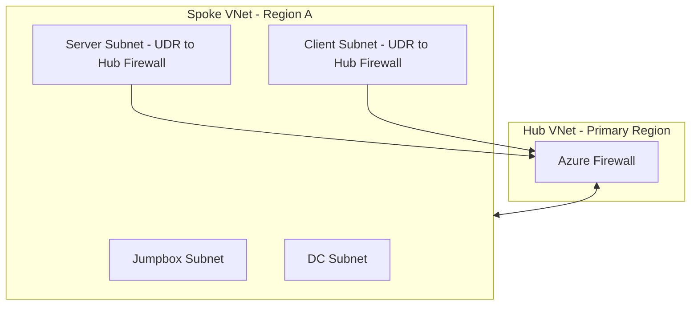

# Architecture

## Overview

AMRL is a subscription-scope Bicep deployment for a multi-region Azure lab. It creates resource groups, hub-and-spoke VNets, subnet and NSG segmentation, Azure Firewall routing, virtual machines, and optional Active Directory automation.

The primary region is the hub. Other selected regions are spokes. Spoke-to-spoke traffic is routed through the hub firewall rather than using direct spoke peering.

## Core Terminology

- **Greenfield deployment**: Creating entirely new infrastructure from scratch. All networking, compute, and identity resources are created fresh.
- **Brownfield deployment**: Reusing existing infrastructure (typically networking) and adding new resources on top. Controlled by the `existingRegions` parameter.
- **Reconciliation model**: Identity automation that can be safely re-executed. Scripts check whether the target state already exists before making changes; missing objects are recreated automatically.
- **AGDLP**: Global Security Groups (containing users) are nested into Domain Local Security Groups (which hold the actual file share permissions).
- **Stage**: Deployment execution mode that controls which resource types are deployed (`network`, `control`, `identity`, `workload`, or `all`). See [Deployment Guide](deployment.md#stages).
- **DC (Domain Controller)**: Primary (`dc01`) or replica (`dc02`, `dc03`, etc.) domain controllers. The primary DC creates the forest; replicas sync from it.
- **Idempotent**: Deployments can be run multiple times safely. Re-running produces the same end state without errors or unwanted recreation.

## Design Principles

- Deterministic deployment: the same inputs always produce the same infrastructure layout.
- Separation of concerns: networking, compute, security, and placement logic are clearly separated into modules.
- Data-driven design: deployment behaviour is controlled through parameter configuration, not template edits.
- Validation before deployment: invalid configurations are surfaced through validation outputs.
- Balanced multi-region distribution: workloads are evenly distributed while respecting regional capacity constraints.
- Security-first approach: minimal exposure, controlled access paths (jumpboxes), and Key Vault-backed credentials.

## Infrastructure as Code

The deployment is declarative. Bicep describes the desired resources, their configuration, scopes, and dependencies. Parameters provide the environment-specific inputs, including regions, VM counts, VM sizes, images, credentials references, and deployment stage.

The root [main.bicep](../main.bicep) orchestrates the deployment. Reusable modules own specific resource types:

- `modules/networking` owns VNets, subnets, NSGs, firewalls, and route tables.
- `modules/peering` owns hub-to-spoke and spoke-to-hub peering.
- `modules/compute` owns Windows and Linux VM resources.
- `modules/identity` owns AD automation, domain joining, and departmental file-service provisioning.
- `modules/logic` owns configuration and capacity validation.

## Resource Scope

`main.bicep` uses subscription scope so it can create one resource group per selected region. Regional resources are deployed into their corresponding resource group with module-level resource-group scope.

## Network Layout

Each region receives a VNet address space derived from its region index:

```text
10.<region index>.0.0/16
```

Subnet indexes are supplied through `subnetIndexMap`. The standard layout is:

```text
firewall = 0
jumpbox  = 1
dc       = 2
server   = 3
client   = 4
```

The hub contains the firewall and control-plane subnets. Spokes contain workload subnets and route tables. NSGs restrict administration and AD traffic by subnet role.

### Network Architecture Diagram



Traffic path: spoke VM -> route table -> hub firewall -> destination (no direct spoke-to-spoke path).

### Subnet Roles and NSG Rules

NSG rules are composed per role in `modules/networking/vnet.bicep` from shared rule building blocks (`adRules`, `adAdvancedRules`, `rdpRules`, `sshRules`):

| Subnet role | Composition | Effective access |
|---|---|---|
| `dc` | `adRules` + `adAdvancedRules` + `rdpRules` | DNS (53), Kerberos (88), LDAP (389), NTP (123), Kerberos password change (464), SMB (445), Global Catalog (3268/3269), LDAPS (636), RPC endpoint mapper (135) and dynamic (49152–65535) from `10.0.0.0/8`; RDP (3389) from jumpbox subnets only |
| `jumpbox` | Single rule | RDP (3389) from `jumpboxAllowedSources` only |
| `server` | `sshRules` + `rdpRules` + `adRules` | SSH (22) and RDP (3389) from jumpbox subnets only; DNS/Kerberos/LDAP from `10.0.0.0/8` |
| `client` | `sshRules` + `rdpRules` | SSH (22) and RDP (3389) from jumpbox subnets only |
| `AzureFirewallSubnet` (hub only) | No NSG | Azure Firewall manages its own rule collections directly |

All rules use `protocol: '*'` and `sourcePortRange: '*'`, relying on Azure NSG stateful filtering to allow return traffic.

### IP Addressing Strategy

All VMs use dynamic private IP allocation. DCs are deployed first into their dedicated per-region DC subnets, so each region's primary DC consistently receives the subnet's first usable address (`.4`; `.0`–`.3` are reserved by Azure). This removes the need for static IP calculations while keeping addressing predictable.

### DNS Configuration and Strategy

Each VNet is configured with up to three DNS servers, derived from `.4` addresses in DC subnets (see `dnsCandidates`/`dnsServers` in `main.bicep`):

1. The hub region's DC is prioritised when present.
2. Remaining regions containing DCs are appended in deterministic order.
3. The list is truncated to a maximum of three DNS servers.

Greenfield VNets receive the current DNS server list derived from DC placement. Brownfield (reused) VNets retain their existing DNS configuration; DNS normalisation across previously deployed VNets is not performed automatically.

## VM Security Features

All VMs (`modules/compute/vm-windows.bicep`, `modules/compute/vm-linux.bicep`) share the same security profile:

- **Trusted Launch**: SecureBoot and vTPM enabled to protect against boot-level attacks and rootkits.
- **System-assigned managed identity**: enables Azure VM Run Commands to execute without external authentication.
- **Boot diagnostics**: enabled for troubleshooting startup issues.
- **Public IP assignment**: jumpbox VMs only; all other roles remain private.

## Controlled Egress

The workload subnets no longer use direct outbound Internet access. Route tables for the server and client subnets send `0.0.0.0/0` to the Azure Firewall private IP, so all egress from those subnets is forced through the hub firewall. This creates a centralized inspection and policy-enforcement point while preserving internal communication and allowed outbound HTTP/HTTPS flows.

This is a controlled-egress design rather than a block-all design: outbound connectivity is still allowed where required, but it is centralized and inspectable at the firewall instead of being direct from the workload subnets.

## Desired State

The template combines the desired VM model with `existingVmPlacements`. Existing VM identities are retained, missing VM identities are created, and the combined placement model is used for validation, DNS generation, capacity calculations, and identity targeting.

The template does not discover live Azure VM inventory. Brownfield users must maintain `existingVmPlacements` in the parameter file.

## File Services

File services are part of the identity workflow and are controlled independently by `enableFileServices`. Directory population runs on the primary DC and, when file services are enabled, creates the domain-local share groups and nests department manager/user groups into them. The separate `file-services.bicep` module then runs `Populate-Shares.ps1` on the selected host to create `C:\Shares`, one SMB share per selected department, and the corresponding NTFS access rules.

By default, the selected host is the primary DC. When `useDedicatedFileServer=true`, the first `srvwin` entry in `finalVmPlacements` is selected. The file-services module is scoped to that VM's resource group and depends on both AD population and Windows domain join, ensuring a dedicated server joins the domain before its AD-backed ACLs are applied.

[Back to README](../README.md)
