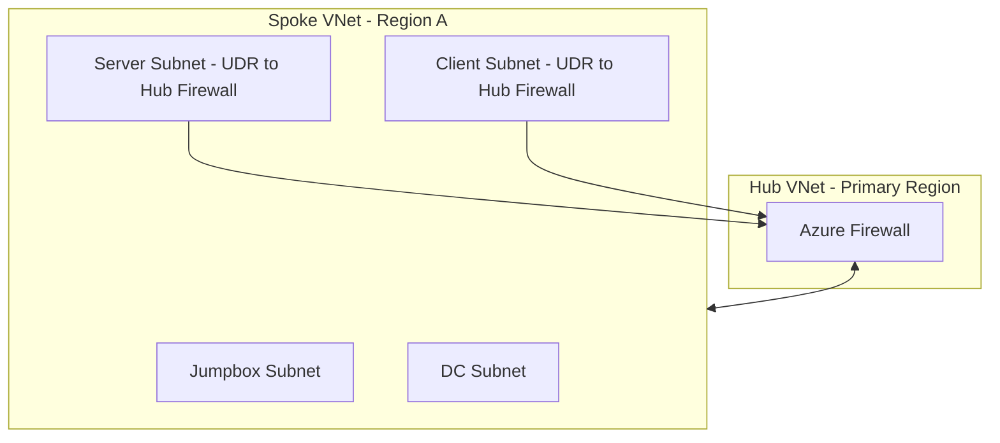

# Architecture

## Overview

AMRL is a subscription-scope Bicep deployment for a multi-region Azure lab. It creates resource groups, selectable VNet topologies, subnet and NSG segmentation, virtual machines, and optional Active Directory automation.

The primary region is always the hub and control-plane anchor. It hosts `dc01` and `jmp01`; other selected regions are spokes. `networkMode` selects connectivity and routing without changing this placement model.

## Core Terminology

- **Greenfield deployment**: Creating entirely new infrastructure from scratch. All networking, compute, and identity resources are created fresh.
- **Brownfield deployment**: Reusing existing infrastructure (typically networking) and adding new resources on top. Controlled by the `existingRegions` parameter.
- **Reconciliation model**: Identity automation that can be safely re-executed. Scripts check whether the target state already exists before making changes; missing objects are recreated automatically.
- **AGDLP**: Global Security Groups (containing users) are nested into Domain Local Security Groups (which hold the actual file share permissions).
- **Stage**: Deployment execution mode that controls which resource types are deployed (`network`, `compute`, `identity`, or `all`). See [Deployment Guide](deployment.md#stages).
- **DC (Domain Controller)**: Primary (`dc01`) or replica (`dc02`, `dc03`, etc.) domain controllers. The primary DC creates the forest; replicas sync from it.
- **Idempotent**: Deployments can be run multiple times safely. Re-running produces the same end state without errors or unwanted recreation.

## Design Principles

- Deterministic deployment: the same inputs always produce the same infrastructure layout.
- Separation of concerns: networking, compute, security, and placement logic are clearly separated into modules.
- Data-driven design: deployment behaviour is controlled through parameter configuration, not template edits.
- Validation before deployment: invalid configurations are surfaced through validation outputs.
- Deterministic, capacity-aware placement: in multi-region deployments, new workloads fill remaining spoke capacity slots in region-index order rather than being evenly balanced. Validation reports insufficient capacity and regional overflow; blocking findings stop stages only in `enforce` mode.
- Security-first approach: minimal exposure, controlled access paths (jumpboxes), and Key Vault-backed credentials.

## Infrastructure as Code

The deployment is declarative. Bicep describes the desired resources, their configuration, scopes, and dependencies. Parameters provide the environment-specific inputs, including regions, VM counts, VM sizes, images, credentials references, and deployment stage.

The root [main.bicep](../main.bicep) orchestrates the deployment. Reusable modules own specific resource types:

- `modules/networking` owns VNets, role subnets, NSGs, firewalls, and route tables.
- `modules/networking/peering.bicep` owns mode-specific hub-spoke or full-mesh peering.
- `modules/compute` owns Windows and Linux VM resources.
- `modules/identity` owns AD automation, domain joining, and departmental file-service provisioning.
- `modules/logic` owns configuration and capacity validation.

## Resource Scope

`main.bicep` uses subscription scope so it can create one resource group per selected region. Regional resources are deployed into their corresponding resource group with module-level resource-group scope.

## Network Topology

The `networkMode` parameter supports three topology creation modes:

| Mode | Peerings | Firewall and routing | Cross-spoke connectivity |
|---|---|---|---|
| `hubSpokeFirewall` | Hub-to-spoke and spoke-to-hub | Azure Firewall, firewall policy, `AzureFirewallSubnet`, route tables, and UDRs | Routed through the hub firewall. |
| `hubSpoke` | Hub-to-spoke and spoke-to-hub | None | Not available. Azure VNet peering is non-transitive. |
| `fullMesh` | Every pair of distinct regions | None | Direct VNet peering between every region. |

`hubSpoke` is suitable for management-focused or firewall-introduction staging environments. It is not a lower-cost replacement for firewall-routed cross-spoke workloads. `fullMesh` avoids Azure Firewall and UDR management, but VNet peering traffic costs and the growing number of peerings should be considered.

The `hubSpoke -> hubSpokeFirewall` transition is supported with `stage=network`: `AzureFirewallSubnet` is reconciled independently of greenfield subnet creation, allowing it to be added to an existing hub VNet. Other topology migrations do not currently remove resources from the prior mode.

## Network Layout

Each region receives a VNet address space derived from its region index:

```text
10.<region index>.0.0/16
```

Subnet indexes are supplied through `subnetIndexMap`. The standard layout is:

```text
firewall = 0
jumpbox  = 1
dc       = 2
server   = 3
client   = 4
```

All modes contain control-plane and role-based workload subnets. In `hubSpokeFirewall`, the hub additionally contains the firewall and `AzureFirewallSubnet`, while spokes receive route tables. NSGs restrict administration and AD traffic by subnet role in every mode.

### Network Architecture Diagram


```mermaid
flowchart TB
  subgraph HUB[Hub VNet - Primary Region]
    FW[Azure Firewall]
  end

  subgraph A[Spoke VNet - Region A]
    AJ[Jumpbox Subnet]
    AD[DC Subnet]
    AS[Server Subnet - UDR to Hub Firewall]
    AC[Client Subnet - UDR to Hub Firewall]
  end

  FW <--> A
  AS --> FW
  AC --> FW
```

This diagram applies to `hubSpokeFirewall`: spoke VM -> route table -> hub firewall -> destination. `hubSpoke` has no spoke-to-spoke path; `fullMesh` uses direct peerings instead.

### Subnet Roles and NSG Rules

NSG rules are composed per role in `modules/networking/vnet.bicep` from shared rule building blocks (`adRules`, `adAdvancedRules`, `rdpRules`, `sshRules`):

| Subnet role | Composition | Effective access |
|---|---|---|
| `dc` | `adRules` + `adAdvancedRules` + `rdpRules` | DNS (53), Kerberos (88), LDAP (389), NTP (123), Kerberos password change (464), SMB (445), Global Catalog (3268/3269), LDAPS (636), RPC endpoint mapper (135) and dynamic (49152–65535) from `10.0.0.0/8`; RDP (3389) from jumpbox subnets only |
| `jumpbox` | Single rule | RDP (3389) from `jumpboxAllowedSources` only |
| `server` | `sshRules` + `rdpRules` + `adRules` | SSH (22) and RDP (3389) from jumpbox subnets only; DNS/Kerberos/LDAP from `10.0.0.0/8` |
| `client` | `sshRules` + `rdpRules` | SSH (22) and RDP (3389) from jumpbox subnets only |
| `AzureFirewallSubnet` (hub only) | No NSG | Azure Firewall manages its own rule collections directly |

All rules use `protocol: '*'` and `sourcePortRange: '*'`, relying on Azure NSG stateful filtering to allow return traffic.

### IP Addressing Strategy

All VM NICs, including DC NICs, use dynamic private IP allocation. Because AMRL uses dedicated DC-only subnets, a DC is highly likely to receive `.4`, the first usable address, in a fresh, otherwise untouched subnet. The template does not explicitly reserve or verify that address.

Multiple DCs in the same subnet are not inherently a problem: one would normally receive `.4` and another `.5`, and either can serve domain DNS after successful promotion. Concurrent creation does not guarantee which named DC receives `.4`, but DNS does not require a particular DC identity there.

The `.4` assumption can fail, or cease to provide a usable DNS endpoint, when:

- The DC and NIC occupying `.4` are deleted while another DC remains at a different address, such as `.5`.
- A DC is moved, recreated, or manually readdressed and its actual address differs from the calculated candidate; declared inventory may also be stale or incomplete.
- An unrelated NIC occupies `.4`, contrary to the DC-only subnet design.
- A DC occupies `.4` but AD promotion or DNS startup fails, the service later becomes unavailable, or the selected topology or network rules prevent clients from reaching it. These are service or connectivity failures, not address-allocation failures.

### DNS Configuration and Strategy

The template calculates up to three DNS server candidates from `.4` addresses in regions containing declared DC placements (see `dnsCandidates`/`dnsServers` in `main.bicep`). It does not discover actual NIC addresses or verify that a working DC occupies each candidate address:

1. The hub region's DC is prioritised when present.
2. Remaining regions containing DCs are appended in deterministic order.
3. The list is truncated to a maximum of three DNS servers.

Greenfield VNets receive the current DNS server list derived from DC placement. Brownfield (reused) VNets retain their existing DNS configuration; DNS normalisation across previously deployed VNets is not performed automatically.

Verify actual DC private IPs and VNet DNS settings during operational readiness checks, particularly after brownfield changes. Explicit DC IP allocation and safe DNS reconciliation are deferred to v4.x Discovery & Full Reconciliation, with architecture and migration scope to be defined during that work. Existing DC addresses must not be changed implicitly.

## VM Security Features

All VMs (`modules/compute/vm-windows.bicep`, `modules/compute/vm-linux.bicep`) share the same security profile:

- **Trusted Launch**: SecureBoot and vTPM enabled to protect against boot-level attacks and rootkits.
- **System-assigned managed identity**: enables Azure VM Run Commands to execute without external authentication.
- **Boot diagnostics**: enabled for troubleshooting startup issues.
- **Public IP assignment**: jumpbox VMs only; all other roles remain private.

## Controlled Egress

Controlled egress applies only to `hubSpokeFirewall`. Server and client subnets send both `10.0.0.0/8` and `0.0.0.0/0` to the Azure Firewall private IP, forcing internal cross-spoke traffic and Internet egress through the hub firewall. Spoke DC and jumpbox subnets send only `10.0.0.0/8` through the firewall, preserving direct Internet access while enabling cross-spoke directory services and administration. Hub DC and jumpbox subnets do not receive these route tables because the hub is directly peered with every spoke.

This is a controlled-egress design rather than a block-all design: outbound connectivity is still allowed where required, but it is centralized and inspectable at the firewall instead of being direct from the workload subnets.

## Topology Transition Boundary

The deployment creates and reconciles resources required by the selected mode, but it does not fully retire resources that are no longer selected. Brownfield cleanup can remove candidate spoke-to-spoke peerings for non-`fullMesh` modes, inferred from `existingRegions`; it does not discover the prior topology. It does not retire firewall resources, route tables, UDR associations, `AzureFirewallSubnet`, or resources retained from reverse or expansion transitions. See [Brownfield Topology Simplification](deployment.md#brownfield-topology-simplification) for the operational boundary and verification requirement.

## Desired State

The template combines the desired VM model with `existingVmPlacements`. Existing VM identities are retained, missing VM identities are created, and the combined placement model is used for validation, DNS generation, capacity calculations, and identity targeting.

The template does not discover live Azure VM inventory. Brownfield users must maintain `existingVmPlacements` in the parameter file.

## File Services

File services are part of the identity workflow and are controlled independently by `enableFileServices`. Directory population runs on the primary DC and, when file services are enabled, creates the domain-local share groups and nests department manager/user groups into them. The separate `file-services.bicep` module then runs `Populate-Shares.ps1` on the selected host to create `C:\Shares`, one SMB share per selected department, and the corresponding NTFS access rules.

By default, the selected host is the primary DC. When `useDedicatedFileServer=true`, the first `srvwin` entry in `finalVmPlacements` is selected. The file-services module is scoped to that VM's resource group and depends on both AD population and Windows domain join, ensuring a dedicated server joins the domain before its AD-backed ACLs are applied.

[Back to README](../README.md)
