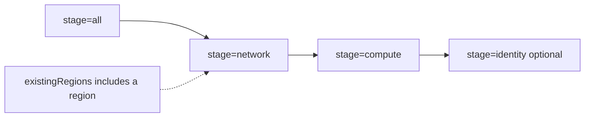

# Deployment Guide

[Back to README](../README.md)

## Prerequisites

- Azure CLI installed and authenticated.
- Access to the target subscription.
- A Key Vault containing the referenced credentials and SSH keys.
- VM sizes, images, regional quota, and regional availability verified for the subscription.
- A parameter file with valid region, network, compute, and identity settings.

## Greenfield Deployment

For a new environment, use an empty `existingRegions` array and an empty `existingVmPlacements` array.

```powershell
az deployment sub create `
  --name <deployment-name> `
  --location <deployment-location> `
  --template-file main.bicep `
  --parameters <parameters-file>.json
```

## Brownfield Deployment

For an existing environment:

- List reused networking regions in `existingRegions`.
- List every retained VM in `existingVmPlacements`.
- Keep the original region indexes for existing VNets.
- Increase `regionCount` only after verifying the new regions and VM sizes.
- Increase VM counts to the desired totals; reconciliation creates only missing VM identities.

Example inventory entry:

```json
{
  "type": "srvlin",
  "index": 2,
  "regionKey": "centralindia"
}
```

## Controlled Egress

Controlled egress applies when `networkMode=hubSpokeFirewall`.

- Server and client workload subnets no longer have direct Internet access.
- Their default route is sent to the Azure Firewall private IP via the route table next hop.
- All outbound Internet traffic from those subnets is inspected and controlled at the firewall before leaving the environment.
- Internal traffic remains allowed, and firewall policy continues to allow required outbound HTTP/HTTPS flows.
- This is a controlled-egress model: the lab still has outbound connectivity where required, but it is centralized and inspectable at the firewall rather than exposed directly from workload subnets.

## Network Topology Modes

| `networkMode` | Deploys | Use case and boundary |
|---|---|---|
| `hubSpokeFirewall` | Hub-spoke peerings, Azure Firewall, policy, `AzureFirewallSubnet`, route tables, and UDRs | Full cross-spoke connectivity through the firewall with controlled workload egress. |
| `hubSpoke` | Hub-spoke peerings only | Management-focused or staging topology. Peering is non-transitive, so spokes cannot communicate with each other. |
| `fullMesh` | Direct peerings between every selected region | Lab, training, and test environments that need direct regional connectivity without firewall or UDR management. |

The hub remains the control-plane region in all modes. Selecting a mode does not change VM placement, DNS candidate selection, or identity orchestration.

### Brownfield Firewall Introduction

Changing `networkMode` from `hubSpoke` to `hubSpokeFirewall` and running `stage=network` adds `AzureFirewallSubnet`, the firewall, policy, route tables, and UDRs without recreating VMs or identity resources. The firewall subnet is reconciled even when the hub VNet is listed in `existingRegions`.

Other topology transitions are creation-only. The template does not remove peerings, firewall resources, route tables, UDR associations, or `AzureFirewallSubnet` that belong to a previous mode. Plan and perform resource retirement explicitly before considering a topology migration complete.

## Stages

| Stage | Behavior |
|---|---|
| `network` | Creates or reuses regional networking and peerings. |
| `compute` | Creates missing DCs, jumpboxes, and workload VMs. |
| `identity` | Runs AD bootstrap, replica promotion, directory population, domain join automation, and optional departmental file-service provisioning. It may also create missing workload VMs needed by the identity flow. Existing control-plane DCs are required. |
| `all` | Runs the complete workflow. |

Typical staged order:

```text
network -> compute -> identity
```



Use a new deployment name when rerunning identity automation so Azure reapplies the VM Run Command resources.

When enabling departmental file services:

- Set `enableIdentity=true` and `enableFileServices=true`.
- Leave `useDedicatedFileServer=false` to host shares on the primary DC.
- Set `useDedicatedFileServer=true` and request or inventory at least one `srvwin` VM to host shares on the first Windows server in the final placement model.
- Run `stage=identity` or `stage=all`; file-service provisioning does not run during the other stages.

## Supported Deployment Models

| Scenario | Supported |
|---|---|
| Greenfield deployment | Yes |
| Full deployment (`stage=all`) | Yes |
| Staged deployment (`network` -> `compute` -> `identity`) | Yes |
| Redeploy an existing environment created by this framework | Yes |
| Reuse existing networking that follows this framework's structure | Yes |
| Modify VM counts, role-based sizes/disks, images, tags, and access settings | Yes |
| Deploy into arbitrary pre-existing VNets with different structures or naming | No |

## Changes Requiring Careful Planning

These parameters can significantly affect topology or addressing, and changing them after deployment may require resource recreation or migration planning:

- `prefix`
- `regionCount`
- `regionIndexMap`
- `subnetIndexMap` (including the `firewall` index)
- `networkMode`

See [Region Indexes](#region-indexes) below for why `regionIndexMap` changes are especially disruptive to existing (brownfield) regions.

## Region Indexes

Region indexes determine VNet address spaces as well as placement order. Existing region indexes are part of the brownfield network contract. Do not renumber existing regions after deployment. A deleted region's index can be reused only after its VNets and peerings have been removed and no remaining VNet uses that address space.

The current validation rule requires region index values to be contiguous and start at `1`. If an index is freed, assign it to the replacement region rather than shifting all existing regions.

## Preflight Checks

```powershell
az vm list-sizes --location <region> -o table
az vm list-usage --location <region> -o table
az vm image list --publisher Canonical --offer 0001-com-ubuntu-server-jammy --sku 22_04-lts-gen2 --location <region>
```

[Back to README](../README.md)
