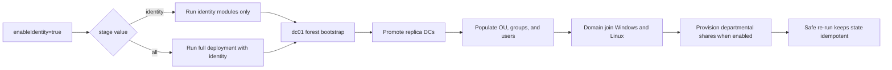

# Identity and Domain Join

[Back to README](../README.md)

## Identity Flow

When `enableIdentity=true`, the identity stage runs this sequence:

```text
Primary DC forest bootstrap
        ->
Replica DC promotion
        ->
Directory population
        ->
Windows and Linux domain join
        ->
Departmental share provisioning (when enabled)
```

The primary DC and replica DCs must already exist before a standalone `identity` stage can complete. Missing workload VMs may be created during the identity stage so they are available for domain joining.



## Directory Model

The `directoryModel` object in `main.bicep` (passed as a JSON string to every identity script) centralises OU paths, group naming, and share configuration so scripts never hardcode AD structure:

- `rootOuName` — top-level OU beneath the domain root (`_ROOT`).
- `customOus` — hierarchical OU structure for computers, groups, and users, including reserved OUs for disabled users.
- `computerOuMapping` — maps VM types to OU locations (e.g. `srvwin`/`srvlin` → `Computers/Servers`, `cliwin`/`clilin` → `Computers/Clients`).
- `groupOuMapping` — OUs for global security groups (`Groups/GGS`) and domain local security groups (`Groups/DLGS`).
- `groupNaming` — configurable prefixes: `globalSecurityPrefix` (`GGS`) for user-facing department groups, `domainLocalSecurityPrefix` (`DLGS`) for share permission groups.
- `platformAdminGroups` — names of the Windows/Linux platform admin groups and the department code they're sourced from.
- `shares` — root share name/path (`C:\Shares`) and the current file server host (`fileServerName`).
- `coreOuMapping` — references to the core `Users`/`Groups` OUs used by scripts.

The directory model is not parameterised; it represents a stable architectural decision. Customisation requires editing `main.bicep` directly.

## Directory Population Rules

`Populate-AD.ps1` enforces these rules on every run (greenfield and brownfield):

- **Manager rule**: exactly one manager per department, identified by a title matching `*Manager*`. If multiple exist, the first is retained and others are demoted. If none exists, a new manager is created from an unused CSV record.
- **Reporting lines**: unmanaged users are assigned to their department's manager; users with invalid or cross-department reporting lines are reassigned.
- **User targets**: `usersPerDepartment` is enforced as a minimum for standard users (managers counted separately). Under-populated departments are topped up; over-populated departments are left as-is.
- **New user addition**: added round-robin across departments that still need users; username collisions are skipped, and population stops with a warning when unique CSV names are exhausted.
- **Platform administrator groups**: Windows and Linux administrator groups are reconciled to the configured `platformAdminGroups.sourceDepartmentCode`; memberships from a previous source department are removed when the configuration changes.
- **Department removal**: removing a department from `additionalDepartments` does not delete its OU or users; the OU becomes unmanaged rather than deleted.

This reflects the non-destructive design: existing compliant objects are preserved, and only missing required objects are restored.

## Departmental File Services

When `enableFileServices=true`, directory population also creates each department's `Share_RW` and `Share_RO` domain-local groups and nests the manager and user groups into them. Share directories are no longer created by `Populate-AD.ps1` on the primary DC.

After Windows domain join completes, `Populate-Shares.ps1` runs on the selected file server. It creates `C:\Shares`, creates one SMB share per selected department, and applies the domain-local groups as NTFS Modify and Read-and-Execute permissions. The script retains existing directories and SMB shares and reapplies the expected ACL rules on reconciliation.

With `useDedicatedFileServer=false`, the selected host is the primary DC. With `useDedicatedFileServer=true`, it is the first `srvwin` VM in the final placement model. See [File Server Reassignment on Brownfield Expansion](placement-and-reconciliation.md#file-server-reassignment-on-brownfield-expansion) before changing this setting in an existing environment.

## Reconciliation

Identity operations use Azure VM Run Command resources. A new deployment name changes the Run Command definition and causes the command to be reapplied. The scripts inspect the current state rather than relying on a persisted reconciliation token.

Examples:

- Forest bootstrap exits when an AD domain already exists.
- Replica promotion exits when the target server is already a DC.
- Windows domain join exits when `PartOfDomain` is true.
- Linux domain join skips `realm join` when the VM is already joined.
- Directory population restores missing OUs, groups, users, and memberships.

## Windows Domain Join

Windows workload VMs are targeted from `finalVmPlacements`. The PowerShell script checks `Win32_ComputerSystem.PartOfDomain` before joining and continues with local administrator configuration and restart behavior when appropriate.

## Linux Domain Join

Linux workload VMs use `realmd`, `adcli`, Kerberos, and SSSD. The script:

1. Validates required inputs.
2. Checks existing realm membership.
3. Installs prerequisites when the VM still needs to join or requires healing.
4. Discovers the domain when a join is required.
5. Runs verbose `realm join` for an unjoined VM.
6. Configures SSSD, automatic home directories, realm access, and Linux administrator sudo rights.
7. Sets the VM hostname to its FQDN (`<hostname>.<domainName>`) and enables SSSD dynamic DNS so the VM registers its own A/PTR records, then triggers an immediate `adcli update` instead of waiting for the next refresh interval.
8. Validates the resulting realm state.

Already joined Linux VMs skip package installation, discovery, and joining but continue the SSSD, access, sudo, and validation steps. This preserves the healing path for partially configured machines.

## Linux Client Desktop Installation

Before Linux clients (`clilin`) join the domain, `modules/compute/linux-desktop.bicep` runs a Run Command that installs `ubuntu-desktop-minimal` and `xrdp`, enabling RDP-based GUI access. It also configures a Polkit rule granting the Linux administrator group interactive authorization for desktop actions. `domainJoinLinux` depends on this step so the desktop environment is present before the client is joined.

Bash scripts are stored with LF line endings through `.gitattributes`:

```gitattributes
*.sh text eol=lf
```

## Troubleshooting

Inspect the VM Run Command instance view when a job exists but a VM is not joined:

```powershell
az vm run-command show `
  --resource-group <resource-group> `
  --vm-name <vm-name> `
  --run-command-name join-domain-linux `
  --expand instanceView
```

A successful Run Command resource deployment does not necessarily mean that the guest script succeeded. Check `executionState`, `exitCode`, `error`, and `output`.

[Back to README](../README.md)
