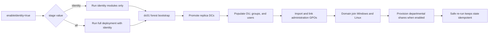

# Identity and Domain Join

[Back to README](../README.md)

## Identity Flow

When `enableIdentity=true`, the identity stage runs this sequence:

```text
Primary DC forest bootstrap
        ->
Replica DC promotion
        ->
Directory population
        ->
Group Policy provisioning
        ->
Windows and Linux domain join
        ->
Departmental share provisioning (when enabled)
```

The primary DC and replica DCs must already exist before a standalone `identity` stage can complete. Missing workload VMs may be created during the identity stage so they are available for domain joining.


```mermaid
flowchart LR
  A[enableIdentity=true] --> B{stage value}
  B -->|identity| C[Run identity modules only]
  B -->|all| D[Run full deployment with identity]
  C --> E[dc01 forest bootstrap]
  D --> E
  E --> F[Promote replica DCs]
  F --> G[Populate OU, groups, and users]
  G --> K[Import and link administration GPOs]
  K --> H[Domain join Windows and Linux]
        H --> I[Provision departmental shares when enabled]
        I --> J[Safe re-run keeps state idempotent]
```

## Directory Model

The `directoryModel` object in `modules/stages/identity-stage.bicep` is passed as a JSON string to identity scripts that require directory structure, group naming, OU mapping, GPO names, or share configuration. It centralises those details so the scripts do not hardcode AD structure:

- `rootOuName` — top-level OU beneath the domain root (`_ROOT`).
- `customOus` — hierarchical OU structure for computers, groups, and users, including reserved OUs for disabled users.
- `computerOuMapping` — maps VM types to OU locations (e.g. `srvwin`/`srvlin` → `Computers/Servers`, `cliwin`/`clilin` → `Computers/Clients`).
- `groupOuMapping` — OUs for global security groups (`Groups/GGS`) and domain local security groups (`Groups/DLGS`).
- `groupNaming` — configurable prefixes: `globalSecurityPrefix` (`GGS`) for user-facing department groups, `domainLocalSecurityPrefix` (`DLGS`) for share permission groups.
- `platformAdminGroups` — names of the Windows/Linux platform admin groups and the department code they're sourced from.
- `gpoNames` — display names of the Server Administration, Client Administration, and Windows LAPS GPOs. Each must match the `DisplayName` inside an exported backup in `GpoTemplates.zip`.
- `shares` — root share name/path (`C:\Shares`) and the current file server host (`fileServerName`).
- `coreOuMapping` — references to the core `Users`/`Groups` OUs used by scripts.

The directory model is not parameterised; it represents a stable architectural decision. Customisation requires editing `modules/stages/identity-stage.bicep` directly.

## Directory Population Rules

`Populate-AD.ps1` enforces these rules on every run (greenfield and brownfield):

- **Manager rule**: exactly one manager per department, identified by a title matching `*Manager*`. If multiple exist, the first is retained and others are demoted. If none exists, a new manager is created from an unused CSV record.
- **Reporting lines**: unmanaged users are assigned to their department's manager; users with invalid or cross-department reporting lines are reassigned.
- **User targets**: `usersPerDepartment` is enforced as a minimum for standard users (managers counted separately). Under-populated departments are topped up; over-populated departments are left as-is.
- **New user addition**: added round-robin across departments that still need users; username collisions are skipped, and population stops with a warning when unique CSV names are exhausted.
- **New account passwords**: each newly created manager or standard AD user receives an independent 24-character password generated with a cryptographic random-number generator. Existing users' passwords are not reset. Generated passwords are not written to Run Command output or retained for retrieval, so user onboarding needs a separate secure password-reset or delivery process.
- **Platform administrator groups**: Windows and Linux administrator groups are reconciled to the configured `platformAdminGroups.sourceDepartmentCode`; memberships from a previous source department are removed when the configuration changes.
- **Department removal**: removing a department from `additionalDepartments` does not delete its OU or users; the OU becomes unmanaged rather than deleted.

This reflects the non-destructive design: existing compliant objects are preserved, and only missing required objects are restored.

## Windows LAPS Active Directory Configuration

During directory population, `Ensure-LapsConfiguration` checks for the `ms-LAPS-Password` schema attribute and extends the AD schema with `Update-LapsADSchema` only when it is missing. It grants computer self-update permission separately on the Servers and Clients OUs, then grants the configured Windows administrators group (default `GGS_Windows_Admins`) permission to read LAPS passwords on both OUs.

The linked Windows LAPS GPO supplies the policy side of this setup: it backs passwords up to Active Directory. After import (or when an existing GPO is found), `Import-GPO-Templates.ps1` reconciles its `ADPasswordEncryptionPrincipal` registry policy value to the live NetBIOS domain and the Windows administrators group derived from `directoryModel`. This keeps the GPO decryptor aligned with the AD read-permission group without re-importing the GPO. Other LAPS policy settings remain creation-time values from the backup; changing those still requires replacing the existing GPO or updating it separately.

## Departmental File Services

When `enableFileServices=true`, directory population also creates each department's `Share_RW` and `Share_RO` domain-local groups and nests the manager and user groups into them. Share directories are no longer created by `Populate-AD.ps1` on the primary DC.

After Windows domain join completes, `Populate-Shares.ps1` runs on the selected file server. It creates `C:\Shares`, creates one SMB share per selected department, and applies the domain-local groups as NTFS Modify and Read-and-Execute permissions. The script retains existing directories and SMB shares and reapplies the expected ACL rules on reconciliation.

With `useDedicatedFileServer=false`, the selected host is the primary DC. With `useDedicatedFileServer=true`, it is the first `srvwin` VM in the final placement model. See [File Server Reassignment on Brownfield Expansion](placement-and-reconciliation.md#file-server-reassignment-on-brownfield-expansion) before changing this setting in an existing environment.

## Reconciliation

Identity operations use Azure VM Run Command resources. A new deployment name changes the Run Command definition and causes the command to be reapplied. The scripts inspect the current state rather than relying on a persisted reconciliation token.

Examples:

- Forest bootstrap exits when an AD domain already exists.
- Replica promotion exits when the target server is already a DC.
- Windows domain join exits when `PartOfDomain` is true.
- Linux domain join skips `realm join` when the VM is already joined.
- Directory population restores missing OUs, groups, users, and memberships.

## Windows Domain Join

Windows workload VMs are targeted from `finalVmPlacements`. The PowerShell script checks `Win32_ComputerSystem.PartOfDomain` before joining and continues with local administrator configuration and restart behavior when appropriate.

## Group Policy Provisioning

After directory population, `modules/identity/ad-gpo.bicep` runs `Import-GPO-Templates.ps1` on the primary DC to create the administration GPOs from exported GPMC backups.

The three required GPO names come from the directory model, so the script does not hardcode them:

```text
gpoNames.serverAdministration   ->  linked to OU=Servers,OU=Computers
gpoNames.clientAdministration   ->  linked to OU=Clients,OU=Computers
gpoNames.windowsLaps           ->  linked to OU=Servers,OU=Computers and OU=Clients,OU=Computers
```

Windows LAPS is linked separately to the Servers and Clients OUs. The Windows administrators group-reference rewrite applies only to the two administration GPOs.

The backups ship as `modules/identity/templates/gpo/GpoTemplates.zip`, embedded in the template with `loadFileAsBase64` and passed to the Run Command as a string parameter. The script writes the zip to `C:\Temp\GpoTemplates.zip` on the DC, expands it to `C:\Temp\GpoTemplates`, and removes any previous extraction first. The archive must contain a top-level `GpoTemplates` folder.

The template validation engine reports flags for a malformed `domainName`, a missing or blank system-administration department code, a missing primary-DC target, and missing or blank names for any of the three required GPOs. These flags are diagnostic outputs and do not by themselves block deployment. On the DC, the script checks that the zip is present and decodable, that it expands to the expected folder, and that each requested GPO has a matching `Backup.xml` display name. It also checks for the target OUs and an existing `Groups.xml` with exactly one member entry before rewriting the Windows administrators reference in the two administration GPOs. Run Command failures fail the deployment.

For all three GPOs, a missing GPO is imported from the backup whose `Backup.xml` `DisplayName` matches the configured name. Existing GPO policy settings are not re-imported. The script ensures each link exists, enables a disabled link, and removes enforcement from an enforced link. Because those link repairs use `if`/`elseif`, a link that is both disabled and enforced may need a second identity-stage run to reach both desired properties.

For Server Administration and Client Administration only, the `Groups.xml` preference is also rewritten on every run so the Windows administrators member matches this domain. Its SID and `NETBIOS\Group` name are derived from `groupNaming.globalSecurityPrefix`, `platformAdminGroups.windowsAdmins`, and the live domain NetBIOS name because the exported template carries values from the domain it was captured in.

For Windows LAPS, the `ADPasswordEncryptionPrincipal` registry policy setting is compared with the current `NETBIOS\<WindowsAdminsGroup>` value on each run and updated only when it differs. The setting is stored under the Windows LAPS Group Policy registry root; the GPO cmdlet updates the policy rather than editing the deployed GPO backup files directly.

`treatFailureAsDeploymentFailure` is enabled on the Run Command, so a guest-script failure fails the deployment instead of reporting success.

### Idempotency and Template Limitations

The zipped template is a creation-time seed, not a desired-state definition. Be aware of these boundaries:

- **Template edits do not reach existing GPOs.** Import is skipped once the GPO exists, so updating `GpoTemplates.zip` and redeploying leaves its policy settings unchanged except for the runtime-reconciled Windows LAPS `ADPasswordEncryptionPrincipal` and the administration GPO `Groups.xml` references. Remove the GPO, or change the name in `gpoNames`, to import a revised template. This preserves in-place policy edits, consistent with the wider reconciliation model.
- **GPO names are coupled to the backups.** `Import-GPO` looks the backup up by display name, so renaming `gpoNames` without re-exporting the backups breaks the import. Template validation reports blank names; at run time, the script fails fast when no backup carries a requested name.
- **The group reference is rewritten in SYSVOL without a version increment.** Step 2 edits `Groups.xml` directly, so clients may not reprocess the preference until the GPO version changes. Only the Windows administrators member is reconciled; other preference content is left as exported.
- **Re-running requires a new Run Command definition.** As with the other identity scripts, use a new deployment name so the Run Command is reapplied.

## Linux Domain Join

Linux workload VMs use `realmd`, `adcli`, Kerberos, and SSSD. The script:

1. Validates required inputs.
2. Checks existing realm membership.
3. Installs prerequisites when the VM still needs to join or requires healing.
4. Discovers the domain when a join is required.
5. Runs verbose `realm join` for an unjoined VM.
6. Configures SSSD, automatic home directories, realm access, and Linux administrator sudo rights.
7. Sets the VM hostname to its FQDN (`<hostname>.<domainName>`) and enables SSSD dynamic DNS so the VM registers its own A/PTR records, then triggers an immediate `adcli update` instead of waiting for the next refresh interval.
8. Validates the resulting realm state.

Already joined Linux VMs skip package installation, discovery, and joining but continue the SSSD, access, sudo, and validation steps. This preserves the healing path for partially configured machines.

### Linux Endpoint Administration Reconciliation

On every identity-stage run, the Linux script reconciles selected SSSD keys, restarts SSSD when one of those keys changes, ensures the `pam_mkhomedir.so` session module is present, and sets the realm login policy to `allow-realm-logins`. That realm policy allows all domain users to log in; administrative sudo is separately limited by the model-derived `GGS_Linux_Admins` sudoers rule. The script checks both the rule content and file mode (`0440`), writes changes to a temporary file, validates them with `visudo`, and then installs the file. This is selective reconciliation of those settings, not a replacement of the full SSSD or host configuration.

## Linux Client Desktop Installation

Before Linux clients (`clilin`) join the domain, `modules/compute/linux-desktop.bicep` runs a Run Command that installs `ubuntu-desktop-minimal` and `xrdp`, enabling RDP-based GUI access. It also configures a Polkit rule granting the Linux administrator group interactive authorization for desktop actions. `domainJoinLinux` depends on this step so the desktop environment is present before the client is joined.

Bash scripts are stored with LF line endings through `.gitattributes`:

```gitattributes
*.sh text eol=lf
```

## Troubleshooting

Inspect the VM Run Command instance view when a job exists but a VM is not joined:

```powershell
az vm run-command show `
  --resource-group <resource-group> `
  --vm-name <vm-name> `
  --run-command-name join-domain-linux `
  --expand instanceView
```

A successful Run Command resource deployment does not necessarily mean that the guest script succeeded. Check `executionState`, `exitCode`, `error`, and `output`.

[Back to README](../README.md)
