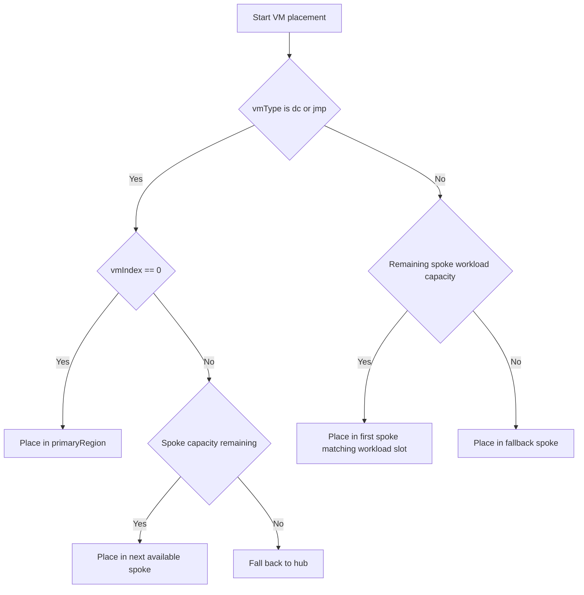

# Placement and Reconciliation

[Back to README](../README.md)

## VM Identity

Each desired VM is identified by its logical role and zero-based index. For example, `srvlin` index `2` becomes `srvlin03`.

```bicep
var existingVmKeys = [
  for vm in existingVmPlacements: '${vm.type}-${string(vm.index)}'
]

var missingVmList = filter(
  vmList,
  vm => !contains(existingVmKeys, '${vm.type}-${string(vm.index)}')
)
```

`missingVmList` is used by VM creation modules. This prevents existing VMs from being recreated during brownfield deployments.

## Placement Rules

1. `dc01` and `jmp01` are pinned to the primary region, which is the hub.
2. Workload VMs are placed on spokes and do not use hub workload capacity.
3. New DCs and jumpboxes fill spoke capacity first-fit, in region-index order, one spoke to its full capacity before the next (not round-robin across spokes).
4. Existing VMs reduce the available capacity of their regions before new placement occurs.
5. Workloads use the remaining spoke capacity after existing and new control-plane occupancy is accounted for.
6. If spoke capacity is exhausted, additional control-plane placement falls back to the hub, which has no capacity limit enforced at placement time.



## Capacity Model

The placement engine counts existing VMs per spoke, calculates available slots, and converts those slots into cumulative boundaries. A new VM's ordinal is mapped to the first boundary that contains it.

This is deterministic desired-state calculation. It is not a live Azure capacity query and cannot detect resources that are missing from the parameter inventory.

## Final Placement Model

Existing inventory is converted into the same internal shape as new placements:

```bicep
var finalVmPlacements = concat(
  existingVmPlacementModels,
  vmPlacements
)
```

The final model is used for:

- Regional VM summaries.
- DC discovery and DNS candidate generation.
- Validation counts.
- Windows and Linux domain-join targeting.

VM creation still uses the missing-only model. Domain-join automation uses the final model so existing workload VMs can be repaired or joined.

## Brownfield Requirements

Before each brownfield expansion, update:

- `existingRegions` with every region whose networking already exists.
- `existingVmPlacements` with every VM that already exists.
- `regionIndexMap` without changing indexes assigned to existing VNets.

## File Server Reassignment on Brownfield Expansion

The `useDedicatedFileServer` parameter controls the file server target:

- `false` — file services always run on the primary DC.
- `true` — file services run on the first `srvwin` VM in `finalVmPlacements`. If none exists, target selection falls back to the primary DC so template evaluation can continue, while `validationFlags.missingDedicatedFileServer` and `validationMessage` report the invalid configuration. Add a Windows server or disable dedicated mode before relying on the result. See [Deployment Results and Troubleshooting](validation-and-troubleshooting.md) for reviewing validation outputs.

File services are provisioned only when `enableFileServices=true` during an `identity` or `all` stage. Dedicated mode also requires `enableIdentity=true`; the validation module reports unsupported combinations.

The file server target is recomputed on every deployment. If a greenfield deployment has no Windows server (file services run on the DC) and a later brownfield deployment adds one, the file server target switches to the new Windows server on that run.

This switch is a target change only, not a migration:

- The new Windows server gets freshly created, empty department shares. Nothing is copied from the DC.
- The DC's existing `C:\Shares` folder, its SMB shares, and its `populate-shares` Run Command resource are left in place; nothing in the template removes them, since the module's resource-group scope now points at the new server's resource group instead.
- Any data or share permissions that existed on the DC must be migrated manually (e.g. via Robocopy) if continuity is required.

[Back to README](../README.md)
