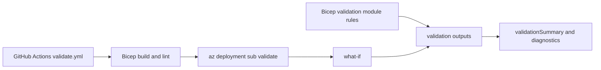

# Deployment Results and Troubleshooting

[Back to README](../README.md)



## Template Validation

`modules/logic/validation.bicep` evaluates configuration and placement rules and returns outputs used by `main.bicep`.

Findings are classified as `block` or `advisory`. With `validationMode=reportOnly`, findings are reported and deployment continues. With `validationMode=enforce`, an active blocking finding makes `validationGate` fail; network, compute, and identity stages depend on that gate and do not execute. Advisory findings do not block enforcement mode.

It checks:

- Required DC and jumpbox counts.
- Region count and index validity.
- Primary DC and jumpbox pinning.
- Non-control VMs remaining outside the hub.
- Desired capacity and regional overflow.
- VM size and OS disk role keys.
- Existing region coverage for staged brownfield deployments.
- Whether compute/identity deployments skip networking for selected regions absent from `existingRegions`.
- Whether newly created VM placements in compute or identity stages target regions missing from `existingRegions` when network provisioning is skipped.
- Remaining workload capacity after existing and new control-plane placement.
- Department and identity configuration.
- File services requiring identity automation.
- Dedicated file-server mode requiring enabled file services and an available `srvwin` VM. See [File Server Reassignment on Brownfield Expansion](placement-and-reconciliation.md#file-server-reassignment-on-brownfield-expansion).

The current template requires `vmCounts.dc >= 1` for every deployment. It evaluates the primary DC and `fileServerName` before the identity and file-service feature flags can suppress their resource modules. With `vmCounts.dc=0`, template evaluation fails because no primary DC exists to supply `fileServerName`; set `dc` to at least `1` and redeploy.

`hasNoDomainControllers` and `hasNoJumpboxes` are evaluated from the final VM placement model, which combines declared existing VM placements with planned placements. They distinguish the loss of the AD control plane from the loss of the supported jumpbox remote-access path; they do not query Azure to confirm that an inventoried VM exists. A zero-DC model can still fail earlier during root-template evaluation as described above, before validation outputs are returned.

## Useful Outputs

- `validationSummary`: Short status for quick review.
- `validationMessage`: First detected validation message.
- `validationFlags`: Boolean validation flags.
- `enforcementEnabled`: Whether `validationMode` is set to `enforce`.
- `shouldBlockDeployment`: Whether enforcement is enabled and blocking findings are active.
- `blockingValidationFlags`: Names of active blocking findings.
- `blockingValidationDetails`: Active blocking findings with category, flag, message, and remediation guidance.
- `blockingValidationSummary`: Summary of active blocking findings.
- `deploymentBlockMessage`: Message used when the enforcement gate fails.
- `advisoryValidationFlags`: Names of active advisory findings.
- `advisoryValidationDetails`: Active advisory findings with category, flag, message, and remediation guidance.
- `networkRegionsMissingFromInventory`: Selected regions missing from `existingRegions` when compute/identity is selected and networking is skipped.
- `newVmRegionsWithoutNetwork`: Target regions for newly created VMs that are not declared in `existingRegions` while the network stage is skipped.
- `workloadCapacitySummary`: Workload demand versus remaining capacity.
- `workloadCapacityByRegion`: Per-region control-plane and workload capacity.
- `invalidExistingVmPlacementDetails`: Existing VM entries whose regions are not active.
- `invalidExistingVmPlacementCount`: Number of invalid existing VM placement entries.
- `hasInvalidExistingVmPlacements`: Whether invalid existing VM placement entries were found.
- `vmPlacement`: Combined existing and new VM placement model.
- `vmCountPerRegion`: Final count by region.
- `regionSummary`: Addressing, subnet, and regional VM summary.

Each entry in `blockingValidationDetails` and `advisoryValidationDetails` includes `category`, `flag`, `message`, and `remediation`. The `remediation` property contains a recommended corrective action; it does not change parameters or repair resources automatically.

## Post-Deployment Review

After deployment, review the outputs before treating the deployment as valid:

```powershell
az deployment sub show `
  --name <deployment-name> `
  --query "properties.outputs.{summary:validationSummary.value,message:validationMessage.value,flags:validationFlags.value,enforcement:enforcementEnabled.value,blocked:shouldBlockDeployment.value,blocking:blockingValidationDetails.value,advisory:advisoryValidationFlags.value,advisoryDetails:advisoryValidationDetails.value,missingNetworkRegions:networkRegionsMissingFromInventory.value,newVmNetworkRegions:newVmRegionsWithoutNetwork.value,capacity:capacityCheck.value,placements:vmPlacement.value}" `
  --output json
```

When enforcement fails, the parent deployment may not return its outputs. The validation-engine nested deployment completes before the gate and retains its outputs. Its name is `<prefix>-validation-engine-<first 20 characters of deployment name>`; inspect it directly:

```powershell
az deployment sub show `
  --name <prefix>-validation-engine-<deployment-name-prefix> `
  --query "properties.outputs.blockingValidationDetails.value" `
  --output jsonc
```

A healthy result has `validationSummary` set to `All validation checks passed.` and `capacityCheck.withinLimit` set to `true`. In `validationFlags`, the following flags should be `false`:

- `hasRegionOverflow`: A region, including the hub, exceeds `maxVmsPerRegion`.
- `invalidCapacity`: The total requested VM count exceeds `regionCount * maxVmsPerRegion`.
- `hasNoDomainControllers`: The final placement model contains no DC, so the AD control plane will be unavailable. A jumpbox may still be present and accessible.
- `hasNoJumpboxes`: The final placement model contains no jumpbox, so the supported remote-access path into the environment is unavailable.
- `hasNonControlInHub`: A workload VM was placed in the hub.
- `hasInsufficientWorkloadCapacity`: Control-plane placement left too few spoke slots for workloads.
- `hasMissingNetworkPrerequisites`: Compute/identity is selected while networking is skipped and one or more selected regions are absent from `existingRegions`. Review `networkRegionsMissingFromInventory`; run `stage=network` first, or list a region only if its networking already exists.
- `hasUncoveredNewVmNetworks`: A compute or identity deployment would create VMs in regions not declared as having existing networking. Run `stage=network` or `stage=all`, or correct `existingRegions` if that networking already exists.
- `missingDedicatedFileServer`: `useDedicatedFileServer` is `true` but no `srvwin` VM exists. Target selection falls back to the primary DC so template evaluation can continue, but the configuration is invalid and should be corrected.
- `invalidDedicatedFileServerConfiguration`: `useDedicatedFileServer` is `true` while `enableFileServices` is `false`.
- `invalidFileServicesIdentityConfiguration`: `enableFileServices` or `useDedicatedFileServer` is `true` while `enableIdentity` is `false`.
- `hasMalformedDomainName`: `enableIdentity` is `true` but `domainName` is blank, single-label, or contains a space, backslash, forward slash, or `@`. Group Policy provisioning builds the domain DN and SYSVOL path to `Groups.xml` from this value. The flag reports the issue before the Run Command, though validation flags are diagnostic and do not by themselves block deployment.
- `hasEmptySysAdminDepartmentCode`: `sysAdminDepartment` is empty or its department code is blank. Group Policy provisioning resolves the Windows admins group created by directory population from this code.
- `hasNoGpoTargetDc`: `enableIdentity` is `true` but `dc01` is not pinned to the primary region. Group Policy is provisioned on the primary domain controller, so there is no target for the import.
- `hasInvalidGpoNames`: `enableIdentity` is `true` but one or more of `serverAdministration`, `clientAdministration`, or `windowsLaps` is empty. The import script uses these names to find the corresponding exported backups.

The template findings cover configuration it can evaluate; they do not replace guest-side checks. Failures inside the Group Policy Run Command itself are reported by the deployment because `ad-gpo.bicep` sets `treatFailureAsDeploymentFailure`. The script fails fast with an explicit message when the base64 ZIP parameter is empty or not decodable, when the expanded archive lacks the `GpoTemplates` root folder or a named GPO backup, when `directoryModel.gpoNames` is incomplete, when a target OU is missing, or when `Groups.xml` does not hold exactly one member entry to reconcile.

`validationFlags` reports each detected condition independently, while `validationMessage` contains only the first matching message in validation order. Capacity messages are evaluated before the stage-network prerequisite message, so inspect the flags and missing-region outputs when more than one condition is present.

`validationFlags` reports each finding independently. `validationMessage` contains only the first active finding in catalog order, with blocking findings listed before advisory findings. In `reportOnly` mode, findings do not block deployment. In `enforce` mode, active blocking findings fail the validation gate before stage modules execute; advisory findings remain non-blocking. This gate does not roll back resources from earlier successful deployments. Some invalid configurations can still fail earlier during template evaluation, such as `vmCounts.dc=0` when the root template requires a primary DC. Also inspect VM Run Command results separately.

The stage network check uses the declared `existingRegions` inventory; it does not discover VNets, confirm role subnets, or verify live connectivity. It checks every selected region because the current subnet contract is produced for the full region set, even when no VM is newly placed there. Validation flags are diagnostic and do not block deployment; when network provisioning is skipped, confirm that every required VNet and role subnet actually exists before deploying VMs.

## Azure Availability Checks

Template validation cannot guarantee that a VM size, image, or quota is available in Azure. Check these independently:

Regional vCPU quotas vary significantly by subscription type:

- **Trial/Free subscriptions**: often 4–8 vCPU per region.
- **Student subscriptions**: often 4 vCPU per region.
- **Standard/Pay-as-you-go subscriptions**: often 20+ vCPU per region.

Example: if each VM uses 2 vCPUs and your regional quota is 4, set `maxVmsPerRegion = 2`.

```powershell
az vm list-sizes --location <region> -o table
az vm list-usage --location <region> -o table
az vm image list --publisher Canonical --offer 0001-com-ubuntu-server-jammy --sku 22_04-lts-gen2 --location <region>
```

Trial and Student subscriptions can have regional quota and SKU restrictions.

## Deployment Operation Checks

```powershell
az deployment operation sub list `
  --name <deployment-name> `
  --query "[].{state:properties.provisioningState,target:properties.targetResource.resourceName}" `
  -o table
```

For VM Run Command failures, inspect the instance view. A resource operation can be reported as `Succeeded` while the guest command has failed; the guest `executionState` and `exitCode` are authoritative for script execution.

[Back to README](../README.md)
