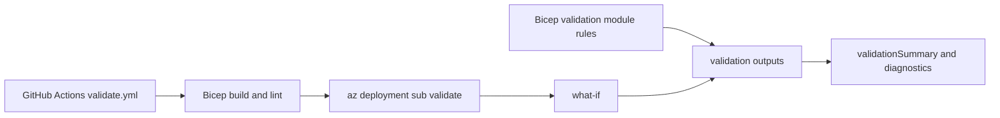

# Deployment Results and Troubleshooting

[Back to README](../README.md)



## Template Validation

`modules/logic/validation.bicep` evaluates configuration and placement rules and returns outputs used by `main.bicep`.

It checks:

- Required DC and jumpbox counts.
- Region count and index validity.
- Primary DC and jumpbox pinning.
- Non-control VMs remaining outside the hub.
- Desired capacity and regional overflow.
- VM size and OS disk role keys.
- Existing region coverage for staged brownfield deployments.
- Remaining workload capacity after existing and new control-plane placement.
- Department and identity configuration.
- File services requiring identity automation.
- Dedicated file-server mode requiring enabled file services and an available `srvwin` VM. See [File Server Reassignment on Brownfield Expansion](placement-and-reconciliation.md#file-server-reassignment-on-brownfield-expansion).

The current template requires `vmCounts.dc >= 1` for every deployment. It evaluates the primary DC and `fileServerName` before the identity and file-service feature flags can suppress their resource modules. With `vmCounts.dc=0`, template evaluation fails because no primary DC exists to supply `fileServerName`; set `dc` to at least `1` and redeploy.

`vmCounts.jumpbox=0` produces the `invalidMinimums` validation flag and message, but does not currently block deployment.

## Useful Outputs

- `validationSummary`: Short status for quick review.
- `validationMessage`: First detected validation message.
- `validationFlags`: Boolean validation flags.
- `workloadCapacitySummary`: Workload demand versus remaining capacity.
- `workloadCapacityByRegion`: Per-region control-plane and workload capacity.
- `invalidExistingVmPlacementDetails`: Existing VM entries whose regions are not active.
- `invalidExistingVmPlacementCount`: Number of invalid existing VM placement entries.
- `hasInvalidExistingVmPlacements`: Whether invalid existing VM placement entries were found.
- `vmPlacement`: Combined existing and new VM placement model.
- `vmCountPerRegion`: Final count by region.
- `regionSummary`: Addressing, subnet, and regional VM summary.

## Post-Deployment Review

After deployment, review the outputs before treating the deployment as valid:

```powershell
az deployment sub show `
  --name <deployment-name> `
  --query "properties.outputs.{summary:validationSummary.value,message:validationMessage.value,flags:validationFlags.value,capacity:capacityCheck.value,placements:vmPlacement.value}" `
  --output json
```

A healthy result has `validationSummary` set to `All validation checks passed.` and `capacityCheck.withinLimit` set to `true`. In `validationFlags`, the following flags should be `false`:

- `hasRegionOverflow`: A region, including the hub, exceeds `maxVmsPerRegion`.
- `hasNonControlInHub`: A workload VM was placed in the hub.
- `hasInsufficientWorkloadCapacity`: Control-plane placement left too few spoke slots for workloads.
- `missingDedicatedFileServer`: `useDedicatedFileServer` is `true` but no `srvwin` VM exists. Target selection falls back to the primary DC so template evaluation can continue, but the configuration is invalid and should be corrected.
- `invalidDedicatedFileServerConfiguration`: `useDedicatedFileServer` is `true` while `enableFileServices` is `false`.
- `invalidFileServicesIdentityConfiguration`: `enableFileServices` or `useDedicatedFileServer` is `true` while `enableIdentity` is `false`.
- `hasMalformedDomainName`: `enableIdentity` is `true` but `domainName` is blank, single-label, or contains a space, backslash, forward slash, or `@`. Group Policy provisioning builds the domain DN and SYSVOL path to `Groups.xml` from this value. The flag reports the issue before the Run Command, though validation flags are diagnostic and do not by themselves block deployment.
- `hasEmptySysAdminDepartmentCode`: `sysAdminDepartment` is empty or its department code is blank. Group Policy provisioning resolves the Windows admins group created by directory population from this code.
- `hasNoGpoTargetDc`: `enableIdentity` is `true` but `dc01` is not pinned to the primary region. Group Policy is provisioned on the primary domain controller, so there is no target for the import.
- `hasInvalidGpoNames`: `enableIdentity` is `true` but one or more of `serverAdministration`, `clientAdministration`, or `windowsLaps` is empty. The import script uses these names to find the corresponding exported backups.

These four flags cover configuration that the template can see. Failures inside the Group Policy Run Command itself are reported by the deployment because `ad-gpo.bicep` sets `treatFailureAsDeploymentFailure`. The script fails fast with an explicit message when the base64 ZIP parameter is empty or not decodable, when the expanded archive lacks the `GpoTemplates` root folder or a named GPO backup, when `directoryModel.gpoNames` is incomplete, when a target OU is missing, or when `Groups.xml` does not hold exactly one member entry to reconcile.

Validation flags and messages are diagnostic outputs; they do not by themselves block deployment, change resources, or roll back resources. Some invalid configurations can still fail earlier during template evaluation when later expressions require their values, such as `vmCounts.dc=0` when the template requires a primary DC. Also inspect VM Run Command results separately.

## Azure Availability Checks

Template validation cannot guarantee that a VM size, image, or quota is available in Azure. Check these independently:

Regional vCPU quotas vary significantly by subscription type:

- **Trial/Free subscriptions**: often 4–8 vCPU per region.
- **Student subscriptions**: often 4 vCPU per region.
- **Standard/Pay-as-you-go subscriptions**: often 20+ vCPU per region.

Example: if each VM uses 2 vCPUs and your regional quota is 4, set `maxVmsPerRegion = 2`.

```powershell
az vm list-sizes --location <region> -o table
az vm list-usage --location <region> -o table
az vm image list --publisher Canonical --offer 0001-com-ubuntu-server-jammy --sku 22_04-lts-gen2 --location <region>
```

Trial and Student subscriptions can have regional quota and SKU restrictions.

## Deployment Operation Checks

```powershell
az deployment operation sub list `
  --name <deployment-name> `
  --query "[].{state:properties.provisioningState,target:properties.targetResource.resourceName}" `
  -o table
```

For VM Run Command failures, inspect the instance view. A resource operation can be reported as `Succeeded` while the guest command has failed; the guest `executionState` and `exitCode` are authoritative for script execution.

[Back to README](../README.md)
